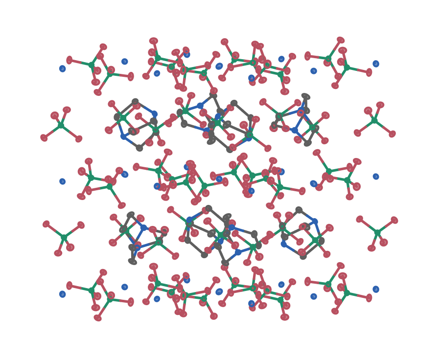
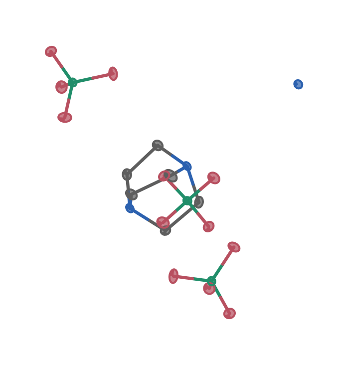
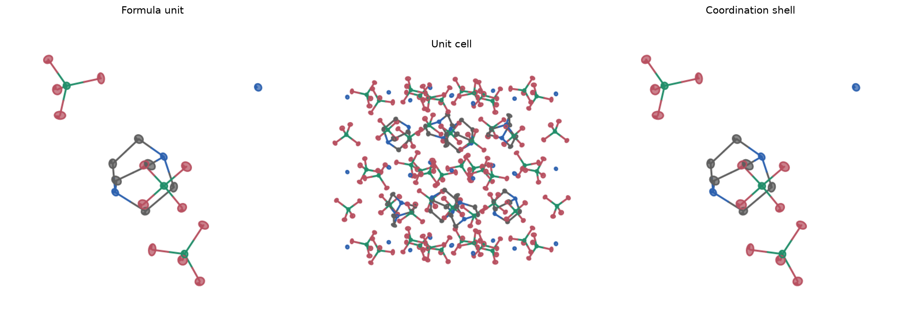
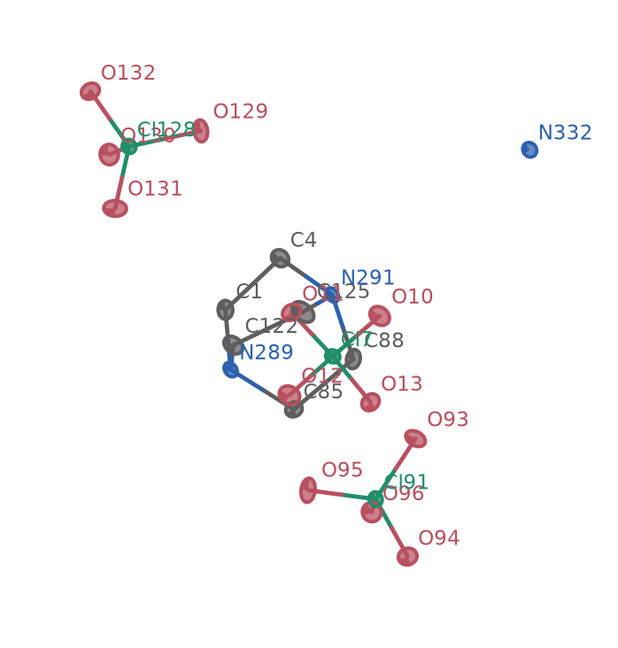
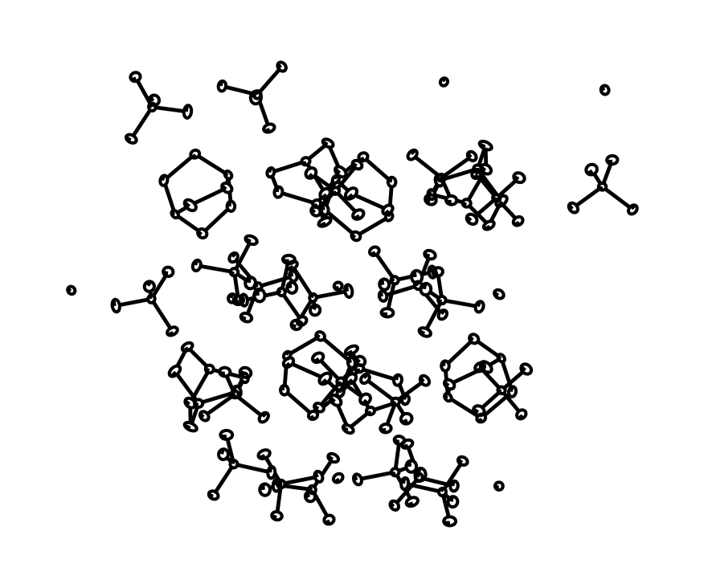

# MatterVis: Crystal Structure Visualization Toolkit

[](https://opensource.org/licenses/MIT)
[](#)
[](https://pypi.org/project/matter-vis/)
[](https://github.com/SchrodingersCattt/MatterVis/actions/workflows/release.yml)

## Overview

MatterVis is a Python toolkit for deterministic, publication-quality material
visualization. Its lightweight core renders PNG/PDF/SVG on the CPU; Plotly,
Dash/Web APIs, Textual, Cube isosurfaces, and animation encoders are optional
frontends.

## Key Features

- **Agent-ready CLI** — Five explicit subcommands (`inspect`, `capabilities`, `render`, `serve`, `tui`) separate bounded diagnosis, dependency preflight, browser-free static output, Web service, and terminal interaction
- **Browser Viewer** — Drag-and-drop CIF upload and interactive 3D display with `Mesh3d` atoms and bonds. `Scatter3d` fast rendering is used only when explicitly selected; atom count never changes the representation
- **Coordination Topology** — Automatic coordination-number detection via the nearest-neighbour gap, continuous shape measure (CShM) classification against 12 ideal polyhedra (CN 4–12), planarity RMS, and prism/antiprism twist analysis
- **Publication Export** — The base CPU backend renders PNG with per-pixel depth handling and emits true-vector PDF/SVG from the same backend-neutral geometry
- **Multi-Panel Figures** — `uniform_viewport(scenes)` stamps a shared world-cube on any list of scenes so every `build_figure` call emits at the same physical length per pixel
- **Automation API** — REST + WebSocket endpoints on the same Flask server; drive the viewer from notebooks, agents, or subprocesses
- **Zero Catalog Required** — Ships with a bundled DAP-4.cif so `mat-vis serve` works out of the box

<p align="center">
  <br>
  <em>Unit Cell — DAP-4 unit cell (flat ORTEP with element colours)</em>
</p>

<p align="center">
  <br>
  <em>Coordination Shell — A-site coordination with convex hull overlay (CN=9, tricapped trigonal prism)</em>
</p>

<p align="center">
  <br>
  <em>Three Display Modes — Formula unit, unit cell, and coordination shell side by side</em>
</p>

<p align="center">
  <br>
  <em>Publication-Quality Export — Colour ORTEP-style Matplotlib renderer with labels</em>
</p>

<p align="center">
  <br>
  <em>Asymmetric Unit — Diagnostic crystallographic view with atom labels and unit-cell context</em>
</p>

## Installation

### From PyPI (recommended)

```bash
pip install matter-vis
```

### From source (development)

```bash
git clone https://github.com/SchrodingersCattt/MatterVis.git
cd MatterVis
python -m pip install "molcrys-kit @ git+https://github.com/SchrodingersCattt/MolCrysKit.git@0a7eb759c11bf3df7272534765b67e5e0f9e5d1d"
pip install -e .
```

All dependencies are declared in `pyproject.toml`; `requires-python = ">=3.10"`.
Install only the frontend the requested output needs:

| Extra | Adds |
|---|---|
| base | CPU PNG/PDF/SVG, inspection, ORTEP, rings, and polyhedra |
| `[plotly]` | Interactive Plotly/WebGL HTML |
| `[plotly-export]` | Plotly + Kaleido static export |
| `[web]` | Dash, REST, WebSocket, compression, and Plotly |
| `[tui]` | Textual terminal UI |
| `[cube]` | Cube input inspection and isosurfaces |
| `[animation]` | GIF/MP4 encoders |
| `[all]` | Every optional frontend |
| `[test]` | Test tools |

Browser screenshots and the Web UI's default static export combine `[web]`
with `[plotly-export]`. Ask the resolver for the exact combined command:

```bash
mat-vis capabilities --require web-screenshot --json
mat-vis capabilities --require static-web-export --json
```

MolCrysKit is required and is the only chemistry structure source. MatterVis
does not fall back to private MolCrysKit fields or local chemistry heuristics.

## Quick Start

### CLI — one-liner from CIF to figure

Install MatterVis, then render a crystal structure with a single command:

```bash
# PNG with default ball-and-stick style
mat-vis inspect structure.cif --json
mat-vis render structure.cif -o figure.png --backend cpu --check --json
mat-vis render structure.cif -o figure.png --backend cpu --json

# PDF, full unit cell, ORTEP hatch marks over flat-shaded ellipsoids
mat-vis render structure.cif -o figure.pdf \
  --backend cpu --view unit_cell --style ortep --material flat \
  --ortep-mode ortep_hatch --missing-adp-policy error

# Interactive HTML for supplementary information
mat-vis render structure.cif -o si_figure.html --backend plotly \
  --show-hydrogen --show-labels

# Launch the interactive browser viewer
python -m pip install "matter-vis[web]"
mat-vis serve --cif structure.cif
```

See [`docs/cli.md`](docs/cli.md) for the full flag reference and common recipes.

### Python API — programmatic control

```python
from mat_viewer.agent import load_structure, prepare_render, render
from mat_viewer.render.contracts import RenderSpec, ViewSpec

structure = load_structure("scripts/data/DAP-4.cif")
plan = prepare_render(
    structure,
    view=ViewSpec(display="unit_cell"),
    render_spec=RenderSpec(backend="cpu", width=900, height=720),
)
result = render(plan, output="dap4.svg", backend="cpu")
```

## Command Line Interface

Installing MatterVis also installs the `mat-vis` command. The CLI is self-documenting;
use `--help` at any level to see the exact arguments:

```bash
mat-vis --help
mat-vis inspect --help
mat-vis capabilities --help
mat-vis render --help
mat-vis serve --help
mat-vis tui --help
```

The main subcommands cover:

- `mat-vis inspect ... --json` — bounded structure/source metadata for agents
- `mat-vis capabilities ... --json` — availability and exact install commands
- `mat-vis render ...` — render atomistic structures and trajectories from CIF, Cube, VASP, XYZ, ASE, and LAMMPS inputs to PNG/PDF/SVG/HTML/GIF/MP4
- `mat-vis serve ...` — launch the interactive Dash browser viewer with drag-and-drop CIF upload, topology analysis, and REST + WebSocket API
- `mat-vis tui ...` — terminal-based crystal structure viewer for headless servers and SSH sessions

## Documentation

| You are… | Start here |
|---|---|
| **Understanding the design** | [Architecture](docs/architecture.md) |
| **Using the library** | [API Reference](docs/agents/) · [CLI Reference](docs/cli.md) |
| **AI agent (calling MatterVis)** | [Caller API Contracts](docs/agents/) |
| **AI agent (modifying code)** | [AGENTS.md](AGENTS.md) · [Developer Notes](docs/dev-notes.md) |
| **Topology scores** | [Scores Reference](docs/scores.md) |

[`mat_viewer/`](mat_viewer/) — source code · [`scripts/`](scripts/) — runnable demo scripts · [`docs/`](docs/) — full documentation

## License

This project is licensed under the MIT License — see the [LICENSE](LICENSE) file for details.
