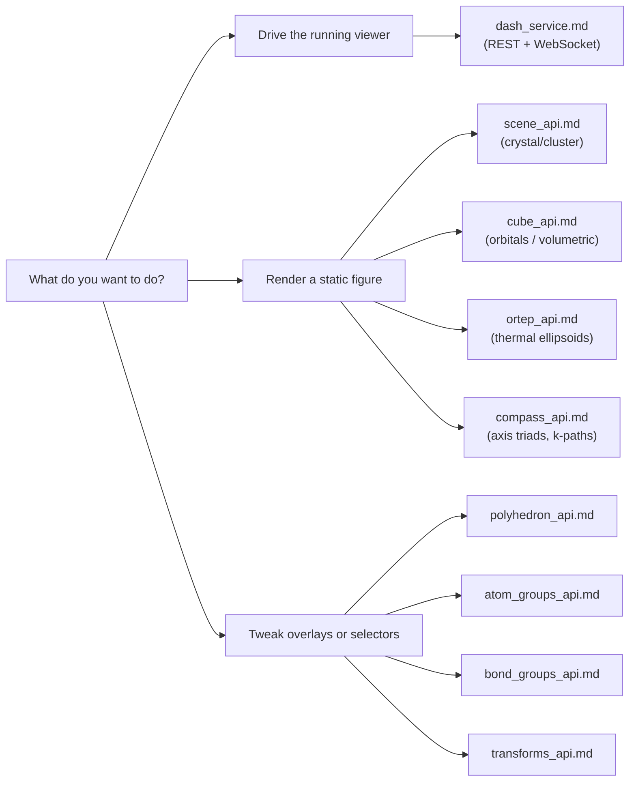
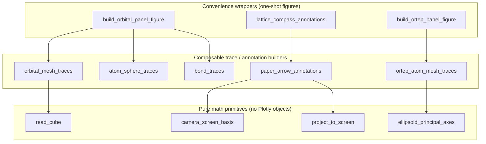

# Calling MatterVis

This folder is for agents and humans **calling** MatterVis — either via
its HTTP/WebSocket service or by importing `crystal_viewer` from Python.
If you are **modifying** the codebase itself, read `../AGENTS.md`
instead.

## Where to drop in

Start from the caller intent and follow the arrow to the doc that owns
the matching public surface.

The same routing as a quick table:

| If you want to… | Read |
|---|---|
| Drive the running Dash viewer over HTTP/WebSocket | [`dash_service.md`](dash_service.md) |
| Build a static crystal/cluster figure from a CIF | [`scene_api.md`](scene_api.md) |
| Build a static cube/orbital figure (HOMO, LUMO, density) | [`cube_api.md`](cube_api.md) |
| Render ORTEP / thermal ellipsoid figures | [`ortep_api.md`](ortep_api.md) |
| Add a/b/c (or x/y/z, k-path, dipole) direction indicators to any 3D plot | [`compass_api.md`](compass_api.md) |
| Manage named coordination polyhedra (per-row colour, ligand restriction, per-instance overrides) | [`polyhedron_api.md`](polyhedron_api.md) |
| Apply per-element / per-group colour, visibility, or render-style overrides | [`atom_groups_api.md`](atom_groups_api.md) |
| Recolour, hide, thin out, or fade chemical bonds by selector | [`bond_groups_api.md`](bond_groups_api.md) |
| Repeat a unit cell, grow by radius / bonds, complete fragments / polyhedra, or generate a slab | [`transforms_api.md`](transforms_api.md) |

## Layered API stack

Every static-figure module in MatterVis follows the same three-layer
shape. When a convenience wrapper does not fit your case, drop one
layer down rather than monkey-patching the wrapper. The arrows below
are "is composed from", not "must call".

The scene API (`build_figure`) follows the same shape; see
[`scene_api.md`](scene_api.md) for its own pipeline diagram.

Caller heuristic: start at the top. If a wrapper hard-codes something
you need to change, the layer below exposes the same primitives the
wrapper uses internally — recompose them in your script rather than
adding a kwarg to the wrapper.

## Cross-cutting conventions

These hold for every consumer, regardless of which API surface you use.

- **Journal-agnostic library.** Typography, dpi, column widths, and
  palette choices for a specific journal are the **caller's**
  responsibility. Keep them in your own `*_style.py` next to your
  scripts. Do not patch `crystal_viewer` to embed journal-specific
  defaults; this library is shared across projects.
- **Override styling at the call site.** Every wrapper that hard-codes
  a colour, font, anchor, or pixel offset also accepts those as keyword
  arguments. Defaults are conveniences, not commitments — pass kwargs
  rather than mutating module dicts (`ELEMENT_COLORS` etc.). Mutating
  module-level state breaks concurrent jobs.
- **Drop down a layer when the wrapper is too narrow.** The high-level
  helpers (`build_orbital_panel_figure`,
  `lattice_compass_annotations`, …) are convenience wrappers around
  exposed primitives (`orbital_mesh_traces`, `project_to_screen`, …).
  If the wrapper does not fit your case, compose the primitives
  directly instead of monkey-patching the wrapper.
- **Read the saved file back.** After every static export
  (`export_static`, `fig.write_image`, …) read the resulting PNG/PDF
  with the file-reading tool of your environment and walk the
  publication-figure-review checklist. Plotly + Kaleido fails silently
  on layout/transparency/legend issues; a successful exit code is not
  evidence of a correct figure.
