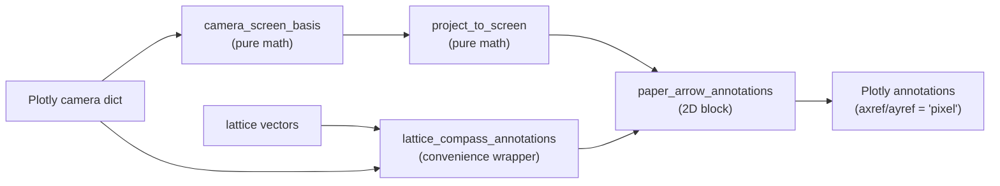

# Camera-projected paper-coord direction indicators

`crystal_viewer.compass` renders direction indicators (a/b/c lattice
triads, k-paths, dipole/force vectors…) as **paper-coord 2D
annotations** rather than in-scene 3D arrows. Use this whenever the
3D content does not have guaranteed empty space — i.e. almost always
in a publication figure.

## Why not just put 3D arrows in the scene?

In a typical orthographic 3D scene with extended molecular content
(especially after PBC unwrapping or tiling), molecules wander past the
cell box edges. Any 3D arrow placed at a fixed data location is liable
to be occluded by atoms. Projecting the camera basis onto the screen
plane and drawing the arrows in **paper coordinates** sidesteps the
occlusion problem entirely.

## Layered API

The module is split into four tiers; pick the lowest tier that meets
your needs.

- Crystal axes triad on every panel → call `lattice_compass_annotations`.
- k-paths, dipole/force vectors, custom direction sets → compose layers
  1–3 directly; layer 4 hard-codes lattice vectors and would otherwise
  fight you.
- Pixel y points DOWN; the wrappers flip the sign on `ay` for you, but
  if you compose layers 1–3 by hand you must do the same.

1. `camera_screen_basis(camera) -> (right, up)`
   Pure camera math. Returns `(right, up)` unit vectors in data
   space (i.e. the 3D directions that point right and up on the
   camera image plane). No Plotly objects involved.

2. `project_to_screen(camera, vectors) -> (N, 2)`
   `(N, 3) → (N, 2)` projection of arbitrary 3D vectors onto the
   camera image plane. Combine with layer 1 if you need the basis
   itself.

3. `paper_arrow_annotations(anchor_xy, deltas_2d, *, fig_size, ...)`
   2D arrow + label rendering at a paper-coord anchor. Agnostic of
   where the 2D directions came from — feed it any
   `(N, 2)` array of pixel/Å deltas. Handles Plotly's pixel offset
   quirks (annotation `axref`/`ayref` must be `"pixel"`, never
   `"paper"`; pixel y points DOWN).

4. `lattice_compass_annotations(camera, lattice, *, panel_x_domains, fig_size, ...)`
   Convenience wrapper around 1+2+3 for the common crystal-axes case.
   Defaults to Wong (2011) colorblind-safe colours and `("a", "b", "c")`
   labels; **every** styling parameter (colours, labels, font, anchor,
   pixel length, label offset, arrow width) is overridable via keyword
   argument.

## When to use which layer

- Crystal axes triad on each panel of an N-up figure → layer 4.
- k-path arrows in a Brillouin-zone plot → compose layers 1–3
  directly (layer 4 hard-codes lattice vectors).
- Force/dipole vectors on a molecule → compose layers 1–3 directly.
- Custom legend whose layout is independent of any 3D camera →
  use Plotly annotations or shapes directly; this module is overkill.

## Hard contracts the library guarantees

- All layer-4 styling parameters are keyword arguments with
  documented defaults. Renderers / wrappers that hard-code journal
  palettes inside the module are bugs.
- Layer 1–3 are pure functions; safe to call from concurrent jobs.
- Annotation arrows always use `axref="pixel"`/`ayref="pixel"`. Plotly
  rejects `"paper"` for arrow tail refs, and pixel y points DOWN —
  these subtleties are absorbed by the wrapper.

## Worked example

See `scripts/06_cp2k_cube_orbital.py` for a/b/c compass anchored
below each panel's 3D scene domain, sized in pixel units relative to
the figure size.
