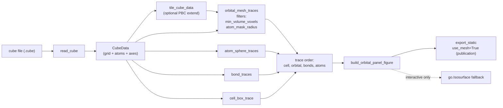
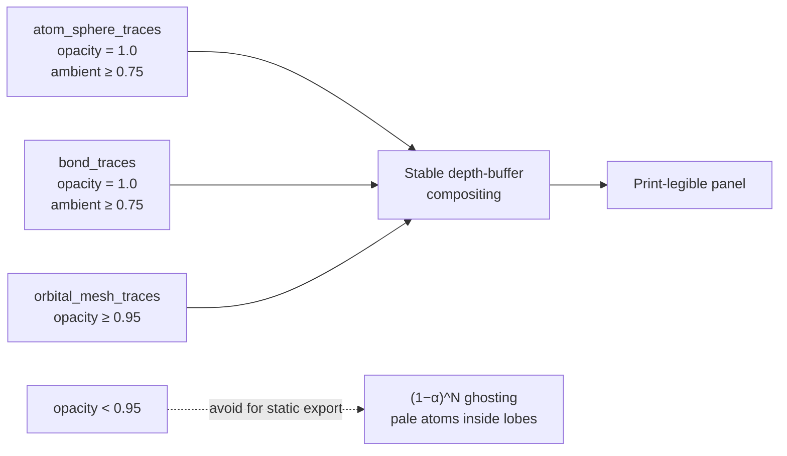

# Cube / orbital rendering API

Static cube isosurface figures (HOMO/LUMO, spin density, charge
density…) are produced by helpers in `crystal_viewer.cube`. The library
is **journal-agnostic** — project-specific styling (typography, dpi,
column widths) lives in caller code, not here.

## Panel construction at a glance

Pick the lowest layer that lets you ship the figure: feed `read_cube`
into your own composition when the wrapper does not fit, but keep the
default trace order or half-transparent orbitals will render on top of
opaque atoms.

## Opacity / ambient discipline

Plotly Mesh3d only z-orders correctly when `opacity == 1.0`. Below 1.0
it falls back to alpha-blending, which compounds as `(1 − α)^N` through
overlapping HOMO/LUMO lobes and washes out atoms behind them.

## Public surface

- I/O
  - `read_cube(path) -> CubeData`
  - `tile_cube(cube, neg, pos)` — extend volumetric data over PBC.
  - `tile_cube_data(cube, neg, pos) -> CubeData` — convenience wrapper
    that preserves atoms/axes and returns a full tiled cube object.
- Primitives (compose your own figure)
  - `orbital_mesh_traces(cube, *, isovalue, ...)` — marching-cubes
    Mesh3d isosurfaces, with built-in noise filtering.
  - `atom_sphere_traces(cube, *, radius_scale=0.5, ...)` — opaque
    Mesh3d spheres.
  - `bond_traces(cube, *, tolerance=1.15, radius=0.09, ...)` — opaque
    Mesh3d cylinders, MIC-aware.
  - `cell_box_trace(lattice, *, origin)` — wireframe parallelepiped.
- Wrappers (one-shot panel figures)
  - `build_orbital_panel_figure(cubes, *, ...)` — N-up panel figure
    with shared camera and ranges.
  - `sign_legend_annotations(...)` — paper-coord +/− swatches.
  - `default_isovalue(values, percentile)` — pick a sensible isovalue
    from the cube grid.
- Static export
  - `export_static(fig, path, *, use_mesh=True, scale=2.0, ...)`

## Hard contracts the library guarantees

These are stable across versions; rely on them.

- **Trace insertion order.** `build_orbital_panel_figure` defaults to
  `DEFAULT_TRACE_ORDER = ("cell", "orbital", "bonds", "atoms")` so
  half-transparent isosurfaces are always composited UNDER opaque
  atoms and bonds. This keeps the molecular skeleton legible
  regardless of orbital density and ensures panels with sparse vs
  dense orbitals look visually consistent. Override only when
  deliberately wanting the inverse stacking; pass `trace_order=(...)`
  with any subset of `{"cell", "orbital", "bonds", "atoms"}`.
- **Tiled-cube cleanliness.** When `tile_cube` has been used to
  extend the volumetric data over PBC images, callers MUST pass both
  `min_volume_voxels > 0` (drops tiny disconnected lobes from
  connected-component analysis) and `atom_mask_radius > 0` together
  with `extra_atom_positions` (zeroes voxels farther than R from any
  atom) to `orbital_mesh_traces` / `build_orbital_panel_figure`.
  Without either, marching-cubes will emit floating phantom lobes
  from PBC-image background noise.
- **Static export.** Use `export_static` (Kaleido) with
  `use_mesh=True` (marching-cubes Mesh3d). `go.Isosurface` is an
  interactive-only fallback because Kaleido currently rasterises it
  inconsistently across versions.
- **Atom + bond geometry are bright + opaque by default.**
  `atom_sphere_traces` and `bond_traces` emit `Mesh3d` primitives at
  `opacity=1.0` with `ambient ≥ 0.75` so phenyl-heavy or
  dark-element-heavy structures remain legible in print. Element
  colors come from `ELEMENT_COLORS`; override per-call via positional
  or keyword arguments rather than mutating the module dict.
- **Orbital opacity defaults to opaque for a reason.** Prefer
  `opacity=1.0` (or ≥ 0.95) for static publication exports. Plotly
  Mesh3d resolves overlap with the depth buffer when
  `opacity == 1.0`, but uses alpha-blending below that — and HOMO/
  LUMO isosurfaces routinely intersect themselves and contain atoms
  inside, so alpha stacks as `(1-α)^N` and washes out atoms behind/
  inside the lobes (visible as ghostly pale spheres). Use
  `opacity < 1.0` only for interactive exploration where seeing
  through the lobe is required.
- **Sign legend uses unicode.** `sign_legend_annotations` emits
  paper-coord swatches using unicode `\u25A0` / `\u2212`. HTML
  entities (`&#9632;`, `&minus;`) corrupt SVG export and must not be
  reintroduced.

## Common pitfalls and what to do instead

- *"My LUCO panel has pale, ghostly atoms but my HOCO panel doesn't."*
  Lower `opacity` on `orbital_mesh_traces` was raised somewhere; reset
  to 1.0 (or 0.95 with a deliberate trade-off accepted).
- *"My orbital figure has lobes floating in vacuum."* You forgot
  `min_volume_voxels` AND/OR `atom_mask_radius` after
  `tile_cube`. Pass both.
- *"My PDF export of a 3D scene looks rasterised."* That is a
  Plotly + Kaleido limitation: 3D scenes are always rasterised on
  PDF export. Either accept it (export at scale ≥ 2) or switch to a
  vector-native pipeline (matplotlib 2D projection).

## Worked example

See `scripts/06_cp2k_cube_orbital.py` for an end-to-end recipe
covering CP2K cube I/O, MolCrysKit-based PBC unwrapping, tiling +
mesh filtering, opaque orbital panels, and paper-coord compass. The CLI
accepts `--no-mesh`, `--show-bonds/--no-bonds`,
`--show-cell-box/--no-cell`, `--opacity`, phase colours, and the same
`--atom-mask-radius` / `--min-volume-voxels` cleanup knobs exposed by
the Python API.
