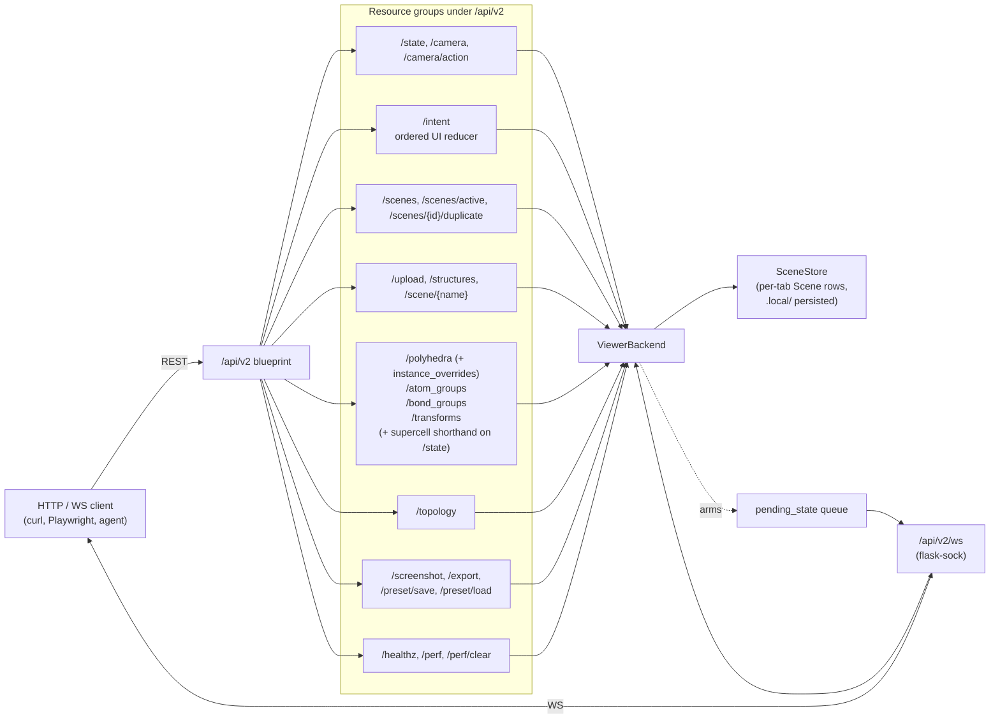
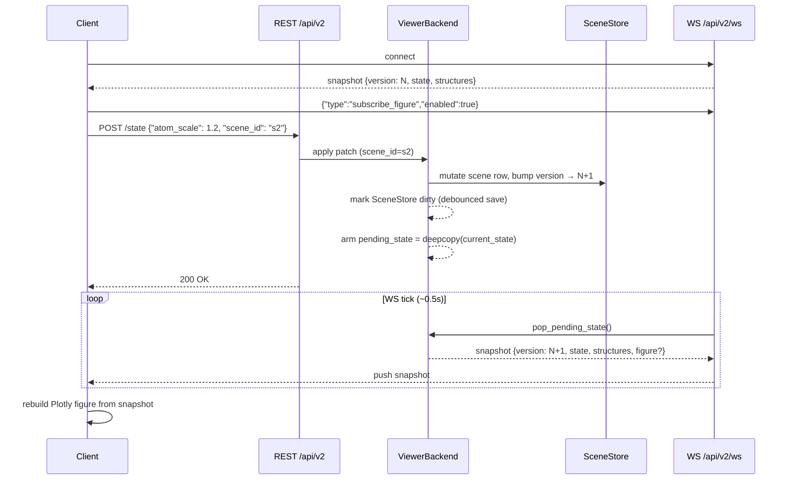
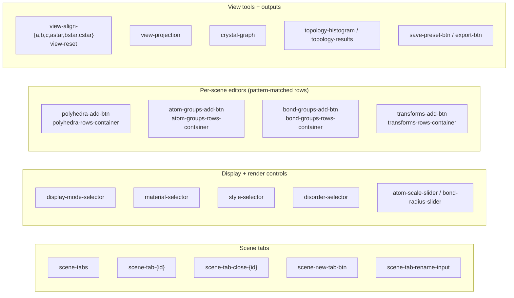

# Dash viewer HTTP/WebSocket service

The interactive Dash app exposes a REST + WebSocket API for driving the
running viewer programmatically — uploads, state changes, screenshots,
preset save/load.

- Base URL: `http://{host}:{port}/api/v2`
- WebSocket: `ws://{host}:{port}/api/v2/ws`

`/api/v1` is a deprecated active-scene shim for one transition release.

## Surface map

All caller traffic lands on the Flask blueprint at `/api/v2`, which
delegates to `ViewerBackend`. Mutations write through to the
`SceneStore` (per-tab `Scene` objects, persisted under `.local/`) and
arm a `pending_state` payload that the WebSocket fans out to every
connected client on its next tick. Browser-originated mutations should
prefer `/intent`, which routes through the reducer and rejects
out-of-order client sequence numbers.



The `supercell` field on `POST /state` is **not** a separate resource:
the backend rewrites it into a single `repeat` transform appended to
the active scene's `transforms` list (overwriting any previous
shorthand-issued `repeat`), so it shows up later under
`GET /transforms`. Use the shorthand for one-line "2×2×2" scripts; use
`/transforms` directly when you need to mix `repeat` with `grow_bonds`,
`slab`, etc.

## Live update contract

The WebSocket is the **only** push channel; REST mutations don't reply
with the full re-rendered figure. Callers that want the figure must
either subscribe to `/api/v2/ws` and consume the `version`-bumped
snapshot, or poll `GET /screenshot?at_version=N` with the version
returned by the mutating call.



Notes for callers:

- `pending_state` is armed on every state-mutating call (REST or
  WebSocket `set_state`), and consumed once per WS tick — clients see
  one push per version, not one push per call.
- `subscribe_figure` pushes completed figure deltas as separate
  `{"type":"figure","figure_seq":...,"figure":...}` frames. Figure
  delivery is asynchronous: a REST or Dash state mutation may return
  before cold topology/polyhedra overlays have been recomputed.
- Scene persistence is debounced. A successful mutation updates memory
  immediately and schedules `.local/crystal_view_scenes.json` for a
  background save; explicit preset/export paths still flush before
  writing their own artifacts.
- For one-shot "wait for my change to land" scripts, the synchronous
  `GET /screenshot?at_version=N` path is simpler than running the WS;
  it blocks until the backend reaches version `N`.

## REST endpoints

- `GET /state`
  Returns the full viewer state. Add `?scene_id=...` to target a
  non-active tab. The response includes `server_started_at`; clients
  can compare this value across calls to detect that the service
  restarted and should refresh uploaded-structure / scene ids.
- `GET /healthz`
  Lightweight liveness probe for automation retry loops. Returns
  `{"ok": true, "uptime_s": ..., "server_started_at": ..., "scenes": N,
  "structures": N, "version": N}` without building a figure.
- `POST /state`
  Accepts any subset of:
  `structure`, `display_mode`, `atom_scale`, `bond_radius`,
  `material`, `style`, `disorder`, `minor_opacity`, `axis_scale`,
  `display_options`,
  `topology_species_keys` (list of stoichiometric formulas like
  `"C8N1"`, `"ClO4"`, `"N1"`; retained for legacy state inspection,
  but named polyhedra now render from `polyhedron_specs`),
  `topology_site_index` (primary site for the histogram /
  results panel), `topology_enabled`, `topology_hull_color`,
  `transforms` (full ordered list of structure mutations; see
  `transforms_api.md`),
  `overlay_overrides` (manual 2D component placement entries; paper
  anchors for fixed viewport components, world anchors plus pixel
  offsets for labels),
  `supercell` (`{a,b,c}` shorthand that gets rewritten as a single
  `repeat` transform — overwrites any existing `repeat` transform
  rather than stacking),
  `bond_groups` (full list of bond-styling overrides; see
  `bond_groups_api.md`),
  `projection` (`"perspective"` / `"orthographic"`; mirrors the
  Plotly camera's `projection.type`. Setting it via `POST /state`
  has the same effect as `POST /camera/action {"action":
  "projection", "type": ...}`),
  `fast_rendering`, `camera`, `cutoff`. `material` is `mesh` or
  `flat`; `style` is `ball`, `ball_stick`, `stick`, `ortep`, or
  `wireframe`; `disorder` is `opacity`, `dashed_bonds`,
  `outline_rings`, `color_shift`, or `none`. Fresh scenes default to
  hydrogens + unit-cell box visible, labels hidden, and
  `label_mode="unique_sites"`.

  Legacy aliases that still work: `topology_fragment_type` (`"A"` /
  `"B"` / `"X"`) is translated to the matching list of species keys
  in the active scene, and `topology_show_all_sites: true` selects
  every species at once.
  `display_mode` accepts `formula_unit`, `unit_cell`, `asymmetric_unit`,
  or `cluster` (free molecular cluster — every parsed atom is drawn,
  no formula-unit trim, no periodic imaging of bonds).
- `POST /intent`
  Ordered mutation reducer for browser and automation clients that want
  one canonical state-machine path. Body:
  `{"type": "...", "payload": {...}, "scene_id": "...",
  "client_id": "browser", "client_seq": 42}`. `client_seq` is optional,
  but when provided it must strictly increase per `client_id`; stale or
  replayed intents return `409`.

  Supported `type` values:
  `set_style`, `set_display_options`, `patch_state`, `set_camera`,
  `set_active_scene`, `crud_scene`, `crud_polyhedron`,
  `crud_atom_group`, `crud_bond_group`, `apply_transform`, and
  `upload_complete`. The response is
  `{"ok": true, "version": N, "state": {...}}` plus action-specific
  details such as `scene` or `removed`.
- `GET /camera`
  Returns the current Plotly camera.
- `POST /camera`
  Sets the full Plotly camera directly.
- `POST /camera/action`
  Convenience camera controls. Examples:
  `{"action": "zoom", "factor": 1.15}`,
  `{"action": "orbit", "yaw_deg": 12, "pitch_deg": -6}`,
  `{"action": "pan", "dx": 0.05, "dy": -0.03, "dz": 0.0}`,
  `{"action": "reset"}`,
  `{"action": "fit"}`,
  `{"action": "align", "axis": "c"}`  (VESTA-style "look down lattice
  axis ``c``"; valid axes are `a`, `b`, `c`, `a*`, `b*`, `c*`),
  `{"action": "projection", "type": "orthographic"}`  (toggle the
  Plotly camera between ``perspective`` and ``orthographic``;
  mirrored onto ``state["projection"]`` so a subsequent ``GET
  /state`` echoes the choice).
  Both `align` and `projection` preserve the current zoom and the
  other half of the camera (alignment keeps projection, projection
  toggle keeps eye/center/up). Use them together to script a
  publication shot, e.g.
  `POST /camera/action {"action": "projection", "type":
  "orthographic"}` followed by `POST /camera/action {"action":
  "align", "axis": "c*"}`.
- `GET /scenes`
  Lists scene tabs and the active scene id.
- `POST /scenes`
  Creates a tab. Body: `{"structure": "DAP-4", "label": "view A",
  "state": {...}}`. If the requested label already exists, the
  server appends a numeric suffix and echoes
  `{"requested_label": "...", "label_renamed": true}` in the returned
  scene payload.
- `PATCH /scenes/{id}`
  Renames or patches a tab.
- `DELETE /scenes/{id}`
  Closes a tab.
- `POST /scenes/{id}/duplicate`
  Duplicates a tab.
- `POST /scenes/reorder`
  Body: `{"order": ["scene_a", "scene_b"]}`.
- `POST /scenes/close_others`
  Body: `{"keep": "scene_id"}` (optional; defaults to the active scene).
  Closes every scene except `keep` in a single call, bumping the state
  version exactly once. Returns
  `{"kept": {...scene}, "removed": [{...scene}, ...]}`. The UI surfaces
  this through the "Close others" button next to the Duplicate-tab `+`.
- `GET /scenes/active` / `POST /scenes/active`
  Reads or changes the active scene.
- `POST /upload`
  Multipart form upload with field `file`. Uploaded CIFs are recorded
  in `.local/crystal_view_uploads.json` by SHA-256 and restored on
  service restart when the on-disk file still exists. Re-uploading the
  same bytes is idempotent: the existing structure is returned with
  `existing: true` instead of creating `_2`, `_3`, ... names. The
  response keeps legacy `atom_count` and also exposes
  `parsed_atom_count`, `displayed_atom_count`, and `asu_atom_count` so
  clients can distinguish CIF parsing from the current display slice.
- `GET /structures`
  Lists the loaded catalog and uploaded structures.
- `GET /scene/{name}`
  Returns the base scene JSON and fragment table. Add
  `?after_transforms=true` to return the current transform-applied draw
  atoms / bonds / fragment table for that structure.
- `POST /topology`
  JSON body: `{"structure": "SY", "center_index": 0, "cutoff": 10.0}`.
  `center_index` is the fragment-table `index` returned by
  `GET /scene/{name}`. The call normally uses the scene's enabled
  `polyhedron_specs`; for one-shot scripts you may include
  `center_species` and `ligand_species` in the body to run an
  ephemeral spec without first mutating `/polyhedra`. Add
  `level: "molecule"` (default) for packing shells between molecular
  fragments, or `level: "atom"` for element-level coordination
  polyhedra such as `{"center_species":"Cl","ligand_species":"O"}`.
  Responses include `analysis_level`; labels are echoed as
  `packing_shell_label` on molecule-level calls and
  `coordination_polyhedron_label` on atom-level calls. Invalid
  `center_index` / `cutoff` values return `400`. Missing scene
  preconditions such as `topology_enabled=false` or no enabled specs
  return `409` with a recovery hint rather than `null`.
- `GET /polyhedra` / `POST /polyhedra` / `PATCH /polyhedra/{id}` /
  `DELETE /polyhedra/{id}` / `POST /polyhedra/reorder`
  Per-scene named-row table for coordination polyhedra. Each row pins
  a centre species + optional ligand species + colour + enabled flag.
  See [`polyhedron_api.md`](polyhedron_api.md) for the spec shape and
  worked examples.
- `GET /atom_groups` / `POST /atom_groups` / `PATCH /atom_groups/{id}` /
  `DELETE /atom_groups/{id}` / `POST /atom_groups/reorder`
  Per-scene atom-group rules for colour / visibility / opacity /
  per-group material+style overrides. The Phase 2 replacement for
  the old binary `monochrome` flag. See
  [`atom_groups_api.md`](atom_groups_api.md). Selectors now also
  accept `labels`, `atom_indices`, `fragment_labels`, and
  `fragment_indices` (AND semantics across keys), so AI callers can
  pin a rule to a specific atom or fragment.
- `GET /bond_groups` / `POST /bond_groups` / `PATCH /bond_groups/{id}` /
  `DELETE /bond_groups/{id}` / `POST /bond_groups/reorder`
  Per-scene bond-styling rules. Selectors are `all`,
  `between_elements`, `labels` (label pairs), and `is_minor`.
  Per rule: `color`, `visible`, `opacity`, `radius_scale`. See
  [`bond_groups_api.md`](bond_groups_api.md).
- `GET /transforms` / `POST /transforms` / `PATCH /transforms/{id}` /
  `DELETE /transforms/{id}` / `POST /transforms/reorder`
  Ordered list of structure mutations applied before rendering:
  `repeat` (supercell), `grow_radius`, `grow_bonds`,
  `complete_fragment`, `complete_polyhedron`, `by_symmetry`, `slab`.
  See [`transforms_api.md`](transforms_api.md). The simplest case
  ("just give me a 2×2×2 view") can use the `supercell` shorthand on
  `POST /state` instead.
- `GET /overlay_overrides` / `POST /overlay_overrides` /
  `PATCH /overlay_overrides/{id}` / `DELETE /overlay_overrides/{id}` /
  `POST /overlay_overrides/reorder`
  Manual placement rules for 2D overlays. Paper-anchored entries
  (`{"kind": "compass", "anchor": "paper", "paper_xy": [0.85, 0.85]}`)
  stay fixed on the viewport. World-anchored entries
  (`{"kind": "atom_label", "anchor": "world", "target_id": "Pb1",
  "pixel_offset": [10, -15]}`) follow the target through camera
  reprojection while preserving the user's pixel drag.
- `POST /polyhedra/{id}/instance_overrides/{fragment_label}`
  Body: `{"color": "#hex", "visible": true|false}`. Pins a single
  matched polyhedron (e.g. one specific Pb cluster) to a different
  colour or hides it without affecting the rest of the spec's tiling.
- `DELETE /polyhedra/{id}/instance_overrides/{fragment_label}`
  Removes a per-instance override and returns that polyhedron to the
  spec defaults. Both endpoints are documented in
  [`polyhedron_api.md`](polyhedron_api.md).
- `GET /screenshot`
  Returns a PNG snapshot of the current Plotly view. Query parameters:
  `scene_id`, `width`, `height`, `scale`, `fast=true`, `at_version`,
  and `timeout`. Use the state `version` returned by mutating calls as
  `at_version=N` to block until the screenshot sees that state (or
  returns 504 after `timeout` seconds). `fast=true` uses the flat
  renderer path for low-latency thumbnails. By default,
  Plotly/Kaleido export failures are returned as a small fallback PNG
  for backwards compatibility. Callers that prefer structured failures
  should send `Accept: application/json`; export failures then return
  HTTP 503 with `{"error": "...", "type": "...", "hint": "..."}`.
- `POST /preset/save`
  Optional JSON body: `{"path": "custom_preset.json"}`. Presets saved
  through v2 use schema `version: 2` and include a `scenes` array plus
  `order` / `active_id`, so scene tabs, cameras, atom groups, bond
  groups, polyhedron specs, and transforms round-trip together. The
  legacy `structures` block is still written for v1-style callers.
  Paths are jailed under `.local/` by default; pass
  `allow_external=true` in the body or query string to explicitly write
  outside that directory.
- `POST /preset/load`
  JSON body: `{"path": "custom_preset.json"}`. `version: 2` presets
  rebuild scene tabs; older presets continue to load via the legacy
  per-structure style path. The same `.local/` jail and
  `allow_external=true` escape hatch apply.
- `POST /export`
  Triggers the vendored `crystal_viewer.static_publication.plot_crystal` exporter
  with the current preset.
- `GET /perf?since=N&limit=M`
  Tail of the in-process perf-event ring buffer. Returns
  `{"events": [...], "latest_seq": N, "log_path": "/tmp/cv-perf.log"}`.
  Each event is `{"seq", "ts", "iso", "kind", "label", "ms", "info"}`.
  `kind` is `cb` (Dash callback), `http` (REST handler), or `event`
  (sub-block of a longer operation, e.g. `loader:parse_asu` inside
  `upload:build_loaded_crystal`). Use `since=` to poll incrementally;
  the buffer keeps the last 1000 events. The full append-only log is
  also written to disk at `log_path` (override with the `CV_PERF_LOG`
  env var on the server). The Dash UI surfaces this as the bottom-right
  "Server log" panel; agents can use the endpoint directly to spot
  slow callbacks or expensive uploads without screen-scraping.
- `POST /perf/clear`
  Empties the in-memory ring buffer (the on-disk log is left alone).

## Error Responses

REST endpoints return JSON error bodies whenever possible:

```json
{"error": "human-readable message", "type": "ValueError", "hint": "optional recovery hint"}
```

Use status codes to distinguish caller mistakes from service state:
`400` for malformed payloads, `404` for unknown ids, `409` for missing
scene preconditions, `503` for temporary renderer/export failures, and
`500` for unexpected server errors.

## Local Proxy Note

On workstations with `HTTP_PROXY` / `HTTPS_PROXY` set, loopback calls
may accidentally route through the proxy. Use `curl --noproxy '*'` or
configure Python `requests` with `session.trust_env = False` (or
`proxies={"http": None, "https": None}`) when calling
`http://127.0.0.1:<port>/api/v2`.

## Stable UI element IDs

Use these when scripting through Selenium / Playwright / Dash testing
hooks rather than the REST surface. These IDs are scraped by external
automation; renaming any of them is a public-API break.



The full list (authoritative; the diagram only groups them):

- `scene-tabs`: scene tab row
- `scene-tab-{id}`: individual scene tab
- `scene-tab-close-{id}`: per-tab close button when rendered
- `scene-new-tab-btn`: duplicate/new scene button
- `scene-tab-rename-input`: active scene rename input
- `scene-cif-upload`: upload zone
- `display-options`: labels / axes / minor-only / wireframe checklist
- `display-mode-selector`: `formula_unit`, `unit_cell`,
  `asymmetric_unit`, `cluster`
- `material-selector`: `mesh`, `flat`
- `style-selector`: `ball`, `ball_stick`, `stick`, `ortep`,
  `wireframe`
- `disorder-selector`: `opacity`, `dashed_bonds`, `outline_rings`,
  `color_shift`, `none`
- `atom-scale-slider`
- `bond-radius-slider`
- `minor-opacity-slider`
- `axis-scale-slider`
- `topology-site-index`
- `topology-toggle` (single "Show polyhedra overlay" checkbox; the
  legacy `topology-species` checklist + `topology-hull-color` picker
  were removed in favour of the named-polyhedra table — see
  `polyhedron_api.md`)
- `polyhedra-add-btn`, `polyhedra-rows-container` (Phase 1 named
  polyhedra editor; per-row inputs are pattern-matched, see
  `polyhedron_api.md` for the `{type, spec_id}` shape)
- `atom-groups-add-btn`, `atom-groups-rows-container`,
  `atom-groups-preset-mono`, `atom-groups-clear-btn` (Phase 2 atom
  groups editor; per-row inputs are pattern-matched, see
  `atom_groups_api.md` for the `{type, group_id}` shape)
- `bond-groups-add-btn`, `bond-groups-rows-container` (Phase 4 bond
  groups editor; per-row inputs are pattern-matched with
  `{type, group_id}` shape, see `bond_groups_api.md`)
- `transforms-add-btn`, `transforms-rows-container`,
  `transforms-kind-select` (Phase 4 transforms editor; per-row
  inputs are pattern-matched with `{type, transform_id}` shape, see
  `transforms_api.md`)
- `view-align-{a,b,c,astar,bstar,cstar}` and `view-reset` (Phase 4
  view tools — VESTA-style axis alignment buttons; clicking them
  fires the matching `POST /camera/action {"action": "align",
  "axis": ...}` on the backend)
- `view-projection` (Phase 4 view tools — `dcc.RadioItems` with
  values `perspective` / `orthographic`; mirrors
  `state["projection"]` and the camera's `projection.type` in both
  directions)
- `crystal-graph`
- `topology-histogram`
- `topology-results`
- `save-preset-btn`
- `export-btn`

## Suggested automation pattern

1. `POST /upload` with a CIF file.
2. `GET /scenes` to discover the uploaded scene tab id.
3. `POST /state?scene_id=...` to set render/display controls without
   disturbing the user's active tab.
4. `POST /topology?scene_id=...` with a chosen `center_index`.
5. `POST /camera/action?scene_id=...` to zoom/orbit/pan if needed.
6. `GET /screenshot?scene_id=...` to capture that scene.
7. `POST /preset/save` if the tuned state should be persisted.

## Right-click / picking layer

The `crystal-graph` figure includes invisible `Scatter3d` "selection"
traces overlaid on atoms, polyhedra, and bond midpoints. Each marker
carries a `customdata` array whose first element is a kind tag, so
client-side code (the right-click menu, custom Plotly listeners,
external automation) can identify what was clicked without parsing
trace names:

| `customdata[0]` | Following fields |
|---|---|
| `"atom"` | `[atom_index, label, element, fragment_label]` |
| `"polyhedron"` | `[spec_id, fragment_label, is_anchor]` |
| `"bond"` | `[[label_i, label_j], [elem_i, elem_j], is_minor]` |

Promoting an ad-hoc click to a persistent rule is a one-shot REST
call:

- atom → `POST /atom_groups` with `selector={"labels": [label]}` or
  `selector={"atom_indices": [atom_index]}`.
- polyhedron → `POST /polyhedra/{spec_id}/instance_overrides/{fragment_label}`.
- bond → `POST /bond_groups` with
  `selector={"labels": [[label_i, label_j]]}` or
  `selector={"between_elements": [elem_i, elem_j]}`.

## WebSocket messages

- Server → client:
  `{"version": <int>, "state": {...}, "structures": [...]}`
  whenever state or structure inventory changes.
- Client → server:
  `{"type": "set_state", "payload": {...}}`

  Optional `"scene_id"` may be sent at the envelope level OR inside
  the inner `"payload"` to target a specific scene without disturbing
  the user's active tab. When omitted the patch lands on the active
  scene (legacy behaviour).

  ```json
  {"type": "set_state", "scene_id": "scene-2", "payload": {"atom_scale": 1.2}}
  ```

## Local-only data

- No CIF files are bundled in the repository.
- Default presets are written under `.local/`.
- Optional local catalog files can be provided via
  `catalog.local.json` or `.local/catalog.local.json`.
