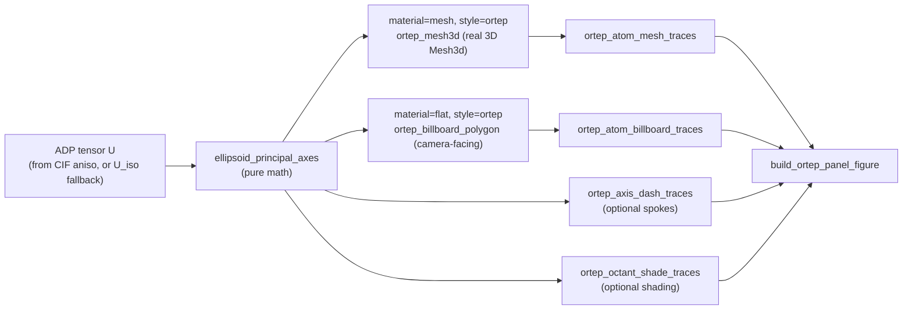

# ORTEP / thermal ellipsoid API

MatterVis supports two ORTEP-style paths:

- `material="mesh", style="ortep"` for real interactive Plotly Mesh3d
  ellipsoids.
- `material="flat", style="ortep"` for publication-style billboards
  derived from the camera projection.

The CIF parser reads `_atom_site_aniso_U_*` into `atom["U"]`; missing
anisotropic data falls back to `_atom_site_U_iso_or_equiv`.

## Layers

- Pure math:
  `ellipsoid_principal_axes`, `ortep_mesh3d`,
  `ortep_billboard_polygon`, `ortep_principal_axis_segments`,
  `ortep_octant_shading`.
- Trace builders:
  `ortep_atom_mesh_traces`, `ortep_atom_billboard_traces`,
  `ortep_axis_dash_traces`, `ortep_octant_shade_traces`.
- Wrapper:
  `build_ortep_panel_figure`.

The render path branches on the `material` + `style` combination, so a
caller picks the visual language by setting two style keys; everything
upstream is shared:

This is the same `math → trace builder → wrapper` shape used by
`cube`, `compass`, and `scene`: callers who outgrow the wrapper drop
one layer down, never monkey-patch the wrapper.

## Style keys

- `ortep_probability` — default `0.5`, matching the common 50%
  probability ORTEP convention.
- `ortep_mode_minor` — optional mode used only for minor / disordered
  atoms. When omitted, minor atoms use the same `ortep_mode` as the
  rest of the scene. Setting `ortep_mode_minor="ortep_axes"` renders
  minor atoms as unfilled projected ellipsoid outlines plus principal
  axes, which pairs cleanly with dashed disorder bonds in static
  crystallographic panels.
- `ortep_show_principal_axes` — draw the three principal-axis spokes.
- `ortep_axis_color`, `ortep_axis_linewidth` — principal-axis styling.
- `ortep_octant_shading`, `ortep_octant_shadow_color`,
  `ortep_octant_shadow_alpha` — optional flat publication shading hooks.

All styling remains caller-overridable via kwargs or the `style` dict.
