# Programmatic scene API

For automation scripts that bypass the Dash UI and drive `build_figure`
directly. The scene API is the lowest-effort path from a CIF (or an ASE
`Atoms`) to a publication-ready Plotly figure of crystal/cluster
geometry.

## Pipeline at a glance

```mermaid
flowchart LR
    CIF["CIF file<br/>or ASE Atoms"] --> LOAD["loader<br/>+ MolCrysKit analysis<br/>(PBC unwrap, mol grouping)"]
    LOAD --> RAW["raw_atoms"]
    RAW --> BUILD["render.assembly<br/>build_scene_from_atoms<br/>(display_mode + H filter)"]
    BUILD --> SCENE["scene dict<br/>{draw_atoms, bonds, cell, style}"]
    SCENE --> SKIN["apply_element_colors<br/>(in-place scene re-skin)"]
    SKIN --> UV["uniform_viewport<br/>(optional, for N-up grids)"]
    UV --> FIG["build_figure"]
    FIG --> OUT["Plotly Figure"]

    BUILD -. "cluster mode skips<br/>formula-unit + PBC bond imaging" .-> SCENE
```

- `display_mode="cluster"` is the only path that bypasses formula-unit
  trimming and periodic bond imaging — every parsed atom is drawn and
  bonds come from stored Cartesian coordinates only.
- `apply_element_colors` mutates the scene it is given; pass the same
  dict to several scenes if you want them to share a palette.
- `uniform_viewport` is only needed when you want N panels to render at
  the same length-per-pixel; single-figure callers can skip it.

## Builders

### `crystal_viewer.scene.build_scene_from_cif(...)`

Parses a CIF and returns a scene dict consumable by
`crystal_viewer.renderer.build_figure`. Honours `display_mode`:

- `formula_unit` (default) — single formula unit centred in the cell.
  Per-species counts come from MolCrysKit's
  `StoichiometryAnalyzer.get_simplest_unit()` (unit-cell species counts
  divided by their GCD), not MatterVis-local hard-coded heuristics.
- `unit_cell` — every atom of the conventional cell, with PBC bond
  imaging.
- `asymmetric_unit` — only the asymmetric unit is drawn.
- `cluster` — **free molecular cluster mode**. Every parsed atom is
  drawn unchanged; no formula-unit selection or periodic image
  reassembly is performed, and bonds are found purely from the stored
  Cartesian coordinates. The 100 Å dummy cells that CIF exporters
  sometimes write around clusters are ignored.

### `crystal_viewer.render.assembly.build_scene_from_atoms(atoms, *, style=None, ...)`

ASE `Atoms` → scene dict. Accepts the same `display_mode` values. When
`style["element_colors"]` is provided, the element palette is applied
automatically.

`crystal_viewer.scene.build_scene_from_atoms` remains available as a
compatibility import, but new code should treat scene assembly as part
of the render pipeline. The `scene/` namespace is reserved for per-tab
state and scene-store helpers.

## Style helpers

### `crystal_viewer.scene.apply_element_colors(scene, element_colors, element_colors_light)`

Re-skin element palettes on a finished scene. Mutates `scene` in place
and returns the same object for chaining; never returns a fresh scene.
Also invoked automatically by `build_scene_from_atoms` when
`style["element_colors"]` is provided.

When `scene["style"]["monochrome"]` is true the function forces every
atom and bond colour to pure black regardless of what `element_colors`
the caller passes, mirroring the rest of the monochrome rendering
pipeline. Callers that want a coloured skin must therefore turn
monochrome off before calling.
Never mutate the module-level `ELEMENT_COLORS` dict — pass kwargs
instead.

### `crystal_viewer.renderer.uniform_viewport(scenes, *, padding=0.0)`

Stamp a shared world-cube `viewport` on a list of scenes so every
subsequent `build_figure` call renders at an identical physical length
scale. The cube is the radius-aware bounding cube of the largest input
scene. Use this for N-up grid figures where each panel must depict the
same length per pixel.

## `build_figure` style keys

Beyond the Dash-driven defaults, `crystal_viewer.renderer.build_figure`
honours:

- `material` — `mesh` for real Mesh3d atoms/bonds, or `flat` for
  billboard-style traces.
- `style` — `ball`, `ball_stick`, `stick`, `ortep`, or `wireframe`.
- `disorder` — `opacity`, `dashed_bonds`, `outline_rings`,
  `color_shift`, or `none`. This is independent from `material` and
  `style`; disorder no longer implies transparent atoms.
- Legacy aliases: `fast_rendering=True` maps to `material="flat"`;
  `minor_wireframe=True` maps to `disorder="outline_rings"`; and
  `minor_opacity` only changes visibility when `disorder="opacity"`.
- `show_title` — set to `False` to suppress the Plotly panel title
  when the caller composes panels externally (e.g. with Matplotlib
  subplot titles or `make_subplots`).
- `axes_labels` — list of three strings substituted for the default
  `["a", "b", "c"]` legend on the axis triad. Clusters typically set
  `["x", "y", "z"]`.
- `element_colors`, `element_colors_light` — per-element hex overrides
  layered on top of the vendored palette. Equivalent to calling
  `apply_element_colors` with the same dicts.
- `projection` — `"perspective"` (default) or `"orthographic"`. Use
  orthographic projection for crystallographic panels where depth
  foreshortening should not change apparent bond lengths.
- `camera_eye_distance` — Plotly camera eye distance multiplier
  (default `1.8`). Larger values reduce perspective depth when
  `projection="perspective"`; orthographic views keep the same visual
  scale but still use the eye direction.

## Worked example

See `scripts/04_static_publication.py` for an end-to-end recipe that
combines `build_scene_from_cif` + `uniform_viewport` + `build_figure` +
`export_static` into a publication PDF.
