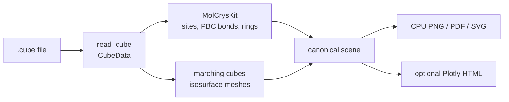

# Cube and isosurface API

Cube support is a volumetric-data adapter, not an independent chemistry
renderer. MatterVis parses the grid, sends the embedded atoms and periodic
cell through the canonical MolCrysKit structure contract, and then adds the
positive and negative isosurface meshes to the backend-neutral scene.



## Installation boundary

- Parse ordinary structures and render PNG/PDF/SVG: base `matter-vis`.
- Parse a Cube grid and extract isosurfaces: `matter-vis[cube]`.
- Render a Cube scene to Plotly HTML: `matter-vis[cube,plotly]`.
- Use Plotly/Kaleido static export: `matter-vis[cube,plotly-export]`.

Run `mat-vis capabilities --require cube --json` for the exact command in the
current environment. Importing `mat_viewer`, `mat_viewer.cube`, or
`mat_viewer.cube.core` does not import scikit-image or Plotly; those packages
are loaded only when their adapters are called.

## Agent-first entry points

Use the same public API as other structure formats:

```python
from mat_viewer.agent import load_structure, prepare_render, render

source = load_structure("density.cube")
plan = prepare_render(source)
result = render(plan, output="density.svg", backend="cpu")
```

The equivalent CLI is:

```console
mat-vis render density.cube -o density.svg --backend cpu --check --json
mat-vis render density.cube -o density.svg --backend cpu --json
```

`--check` resolves `[cube]` without loading the file or creating output.

For the optional Plotly frontend, `build_cube_figure(path, ...)` is the public
bridge. It still obtains atoms, bonds, image shifts, and display fragments from
the canonical loader before adding the isosurface overlay.

## Stable data surface

- `CubeAtom` and `CubeData` hold embedded atoms, origin, axes, and scalar data.
- `read_cube(path) -> CubeData` performs pure Cube IO.
- `tile_cube` and `tile_cube_data` explicitly replicate a scalar grid.
- `default_isovalue(values, percentile)` chooses a threshold strictly inside
  the positive/negative value range or fails when no surface can exist.
- `cube_isosurface_meshes(cube, ...)` in `mat_viewer.cube.cpu` lazily uses
  scikit-image and returns backend-neutral vertices, triangles, normals,
  colour, and opacity.
- `ensure_cube_isosurfaces(structure)` attaches those meshes to the canonical
  scene consumed by CPU or Plotly renderers.

Standalone `bond_traces`, `build_orbital_figure`, and
`build_orbital_panel_figure` are intentionally not exported. They inferred
chemistry from direct Euclidean distances, which loses periodic boundary bonds
and creates a second structure truth. Compose multiple completed views in an
external layout tool instead of using an independent panel chemistry path.

## Contracts and failure behaviour

- MolCrysKit owns bond thresholds, PBC image shifts, molecule grouping, rings,
  and formula-unit selection. Cube code never re-detects those relationships.
- `periodic=True` closes the scalar grid by appending wrapped endpoint planes;
  it does not create a structural supercell.
- `periodic_image_policy="cell"` keeps a canonical base-cell component;
  `"nearest_atom"` selects the image nearest a displayed canonical atom.
- A missing `[cube]` extra raises an installation error. The renderer never
  drops isosurfaces or disables component filtering silently.
- CPU vector output remains true vector geometry. Plotly 3D PDF/SVG export is
  rasterized by Plotly/Kaleido and is therefore a distinct explicit backend.
- Supply the final Plotly camera to `build_cube_figure`; changing it after the
  figure is built can desynchronize baked compass annotations.

## Common checks

```console
mat-vis inspect density.cube --json
mat-vis capabilities --require cube --json
mat-vis render density.cube -o density.png --backend cpu --check --json
```

If marching cubes reports that the level does not cross the data, choose an
explicit isovalue inside the scalar range. If isolated noise components remain,
use the component-size and atom-mask controls deliberately; absence of their
optional implementation is an error rather than a visual fallback.
