# Programmatic scene API

For automation scripts that bypass the Dash UI and drive `build_figure`
directly. The scene API is the lowest-effort path from a CIF (or an ASE
`Atoms`) to a publication-ready Plotly figure of crystal/cluster
geometry.

## Pipeline at a glance

```mermaid
flowchart LR
    CIF["CIF file<br/>or ASE Atoms"] --> LOAD["loader<br/>+ MolCrysKit analysis<br/>(PBC unwrap, mol grouping)"]
    LOAD --> RAW["raw_atoms"]
    RAW --> BUILD["render.assembly<br/>build_scene_from_atoms<br/>(display_mode + H filter)"]
    BUILD --> SCENE["scene dict<br/>{draw_atoms, bonds, cell, style}"]
    SCENE --> SKIN["apply_element_colors<br/>(in-place scene re-skin)"]
    SKIN --> UV["uniform_viewport<br/>(optional, for N-up grids)"]
    UV --> FIG["build_figure"]
    FIG --> OUT["Plotly Figure"]

    BUILD -. "cluster mode skips<br/>formula-unit + PBC bond imaging" .-> SCENE
```

- `display_mode="cluster"` is the only path that bypasses formula-unit
  trimming and periodic bond imaging — every parsed atom is drawn and
  bonds come from stored Cartesian coordinates only.
- `apply_element_colors` mutates the scene it is given; pass the same
  dict to several scenes if you want them to share a palette.
- `uniform_viewport` is only needed when you want N panels to render at
  the same length-per-pixel; single-figure callers can skip it.

## Builders

### `mat_viewer.agent.load_structure(..., bond_scale=None)`

The agent-facing loader exposes MolCrysKit's global bond-perception coefficient
for CIF and ASE-readable inputs. A positive explicit value is forwarded through
canonical loading, molecule grouping, and scene construction. Omit it to retain
the existing default. The CLI exposes the same control as `--bond-scale`.

### Auxiliary cells

`agent.prepare_render` and `agent.render` accept `cell_overlays=[...]`.
The same list may be stored in a scene under the `cell_overlays` key; an
explicit argument wins. Each entry supplies an ID, a 3 by 3 world-space matrix,
an optional origin, color, width, dash pattern, alpha, and depth-test flag.
Auxiliary cell corners participate in automatic camera fitting.

These cells are annotations only. They do not change the structure's canonical
lattice, atom coordinates, bonds, or periodic-image policy. See
[`cell_overlays_api.md`](cell_overlays_api.md) for the schema and examples.

### `mat_viewer.scene.build_scene_from_cif(...)`

Parses a CIF and returns a scene dict consumable by
`mat_viewer.renderer.build_figure`. Honours `display_mode`:

- `formula_unit` (default) — single formula unit centred in the cell.
  Per-species counts come from MolCrysKit's
  `StoichiometryAnalyzer.get_simplest_unit()` (unit-cell species counts
  divided by their GCD), not MatterVis-local hard-coded heuristics.
- `unit_cell` — every atom of the conventional cell, with PBC bond
  imaging. When MolCrysKit canonical bond records are available, every
  manifested boundary-fragment image receives the corresponding canonical
  edge instances. This preserves the chemistry of a whole boundary replica
  without re-perceiving bonds on display atoms. The view also includes one
  adjacent periodic image for sites within `0.03` fractional units of a cell
  face (`0.99 -> -0.01`, `0.01 -> 1.01`). If any member of a known molecule
  triggers an image, the complete molecule is translated. Image shifts are
  unioned per member; face signals from different members are never combined
  into an unsupported diagonal image.
  Library callers that need a strict publication cell can pass
  `include_boundary_replicas=False` to `build_scene_from_atoms` or
  `build_bundle_scene`. Atom centres are wrapped into `[0, 1)` and no adjacent
  image is emitted. Cross-boundary bonds whose in-cell endpoints would create
  a long line are omitted rather than drawn outside the cell. The default is
  `True` to preserve the interactive whole-fragment convention.
- `asymmetric_unit` — only the asymmetric unit is drawn.
- `cluster` — **free molecular cluster mode**. Every parsed atom is
  drawn unchanged; no formula-unit selection or periodic image
  reassembly is performed, and bonds are found purely from the stored
  Cartesian coordinates. The 100 Å dummy cells that CIF exporters
  sometimes write around clusters are ignored.

**CIF input notes.** The `_asym_index` column
(`_atom_site.label_asym_id` mapped to a 0-based index) may be `None` in CIF
inputs that lack `_atom_site_symmetry_multiplicity` or related fields. When
`_asym_index` is absent, the loader bridge falls back to using the stable
row-order index of each site as its asymmetric-unit identifier.

### `mat_viewer.render.assembly.build_scene_from_atoms(atoms, *, style=None, ...)`

ASE `Atoms` → scene dict. Accepts the same `display_mode` values. When
`style["element_colors"]` is provided, the element palette is applied
automatically.

Programmatic builders also accept `bond_scale=` as one positive global
MolCrysKit coefficient. It multiplies calibrated element-class bonding cutoffs:
values below `1.0` tighten connectivity and values above `1.0` loosen it. Pass
the same value to source loading/molecule analysis and scene construction so
PBC unwrapping and visible bonds cannot disagree. `bond_radius` and
`scatter_bond_scale` affect appearance only, not connectivity.

For uniformly compressed or expanded structures, try and validate one global
`bond_scale` first. Use `bond_thresholds=` only when no global coefficient can
retain all intended bonds while excluding compressed intermolecular contacts.
Explicit pair thresholds are also multiplied by `bond_scale`; they are not an
independent post-processing filter.

`mat_viewer.scene.build_scene_from_atoms` remains available as a
compatibility import, but new code should treat scene assembly as part
of the render pipeline. The `scene/` namespace is reserved for per-tab
state and scene-store helpers.

## Style helpers

### `mat_viewer.scene.apply_element_colors(scene, element_colors, element_colors_light)`

Re-skin element palettes on a finished scene. Mutates `scene` in place
and returns the same object for chaining; never returns a fresh scene.
Also invoked automatically by `build_scene_from_atoms` when
`style["element_colors"]` is provided.

When `scene["style"]["monochrome"]` is true the function forces every
atom and bond colour to pure black regardless of what `element_colors`
the caller passes, mirroring the rest of the monochrome rendering
pipeline. Callers that want a coloured skin must therefore turn
monochrome off before calling.
Never mutate the module-level `ELEMENT_COLORS` dict — pass kwargs
instead.

### `mat_viewer.renderer.uniform_viewport(scenes, *, padding=0.0)`

Stamp a shared world-cube `viewport` on a list of scenes so every
subsequent `build_figure` call renders at an identical physical length
scale. The cube is the radius-aware bounding cube of the largest input
scene. Use this for N-up grid figures where each panel must depict the
same length per pixel.

### `mat_viewer.renderer.build_publication_figure(...)`

This is a legacy private compositor retained for the browser application's
internal compatibility surface. The agent-facing CLI does not expose it:
legacy `--publication-*`, `--title`, and `--subtitle` flags fail explicitly.
Agents render one verified CPU SVG/PDF/PNG per view and compose panels in a
separate authorized document or graphics step. Do not call this builder to
bypass that boundary.

For `level="atom"`, each specification is tiled over every unique visible
`(raw source atom, periodic image)` matching `center_species`. The main panel
therefore shows the complete coordination-polyhedron packing represented by the
selected display mode, while the lower row keeps one representative shell per
specification. Molecule-level specifications retain fragment-centred tiling.

Polyhedron paint is independent from the atom `material` and from which tile is
the analysis anchor. Each repeated `--polyhedron` JSON object may set `opacity`,
`edge_opacity`, `edge_width`, and `flatshading`; every periodic equivalent and
its representative panel inherit the same values. Defaults are `0.55`, `0.90`,
`3.0`, and `true`, respectively.

## `build_figure` style keys

Beyond the Dash-driven defaults, `mat_viewer.renderer.build_figure`
honours:

- `material` — `mesh` for real Mesh3d atoms/bonds, or `flat` for
  billboard-style traces.
- `style` — `ball`, `ball_stick`, `stick`, `ortep`, or `wireframe`.
- `scatter_atom_scale` — multiplier for fixed-pixel atom markers in the
  explicitly selected fast Scatter3d mode (default `0.45`).
- `scatter_bond_scale` — multiplier for fast Scatter3d bond-line width
  (default `1.0`).
- `scatter_bond_contrast_color` — optional replacement for a fast bond half
  whose colour has insufficient luminance contrast with the background.
- `disorder` — `opacity`, `dashed_bonds`, `outline_rings`,
  `color_shift`, or `none`. Occupancy-driven opacity is now applied by
  default to **all** loader-confirmed disordered atoms (not only
  unresolved sites): each disordered atom's alpha is proportional to its
  crystallographic occupancy. Set `disorder="none"` to opt out and render
  disordered atoms fully opaque. This is independent from `material` and
  `style`.
- Legacy aliases: `fast_rendering=True` maps to `material="flat"`;
  `minor_wireframe=True` maps to `disorder="outline_rings"`; and
  `minor_opacity` only changes visibility when `disorder="opacity"`.
- Explicit `fast_rendering=True` preserves every manifested scene bond and draws
  its endpoint-coloured bond halves after the fixed-pixel atom markers. This
  ordering keeps short N-H/O-H bonds visible in fitted unit-cell overviews;
  Mesh3d retains depth-correct bond-before-atom ordering.
- `show_title` — set to `False` to suppress the Plotly panel title
  when the caller composes panels externally (e.g. with Matplotlib
  subplot titles or `make_subplots`).
- `axes_labels` — list of three strings substituted for the default
  `["a", "b", "c"]` legend on the axis triad. Clusters typically set
  `["x", "y", "z"]`.
- `element_colors`, `element_colors_light` — per-element hex overrides
  layered on top of the vendored palette. Equivalent to calling
  `apply_element_colors` with the same dicts.
- `projection` — `"perspective"` (default) or `"orthographic"`. Use
  orthographic projection for crystallographic panels where depth
  foreshortening should not change apparent bond lengths.
- `camera_eye_distance` — Plotly camera eye distance multiplier
  (default `1.8`). Larger values reduce perspective depth when
  `projection="perspective"`; orthographic views keep the same visual
  scale but still use the eye direction.
- `ortho_scale` — explicit half-height of the orthographic viewing
  volume in world (Å) units. When set, overrides the auto-fitted scale
  derived from visible atom bounds. Useful for locking panel sizes
  across a figure grid.
- `camera_fit` — strategy for fitting the camera to content.
  `"cell_and_visible_atoms"` (default when cells are drawn) fits to
  both cell corners and visible atoms. `"visible_atoms"` fits only to
  atomistic content, ignoring cell geometry — use this when background
  atoms (hydrogen, etc.) are hidden and the cell would waste viewport
  space.

Anchored scientific arrows are supplied with `vector_overlays=` or
`scene["vector_overlays"]`; see [vector overlays](vector_overlays_api.md).
They are world-space Mesh3d content and therefore differ from corner compass
annotations.

## Static exports and interaction traces

`build_figure(..., include_interaction_traces=False)` and
`build_row_figure(..., include_interaction_traces=False)` omit transparent
atom/bond/polyhedron picking markers and the empty disorder-preview overlay.
Use this for Kaleido/publication exports. The default remains `True` for the
interactive Dash viewer, where these traces provide hover and right-click hit
targets.

Picking markers explicitly disable their Plotly marker outlines. Relying on a
transparent marker fill alone is unsafe because Plotly may resolve a white
bubble-marker outline, which becomes a visible WebGL artifact in static export.
- `camera` — explicit Plotly camera mapping. The CLI exposes this as
  `--camera-axis`, `--view-direction`, `--camera-position`, and
  `--camera-up`. Static CLI renders default to a `+c` lattice-axis view with
  orthographic projection. Programmatic callers may pass `eye` / `center` /
  `up`, or the legacy `position` / `focal_point` / `up` form.

## Worked example

See `scripts/04_static_publication.py` for an end-to-end recipe that
combines `build_scene_from_cif` + `uniform_viewport` + `build_figure` +
`export_static` into a publication PDF.

## Interactive scene-state persistence

The Dash service treats `ViewerBackend.record_state()` and
`patch_state()` as fire-and-forget memory updates. They update the
active per-tab `Scene` immediately, mark the `SceneStore` dirty, and
return without writing `.local/crystal_view_scenes.json` on the request
thread. A background debounce worker performs the disk save, and
explicit preset/export flows flush before producing their artifacts.

For UI/browser mutations, prefer `/api/v2/intent` or
`ViewerBackend.apply_intent()` over writing multiple Dash stores
directly; the reducer gives each client an ordered mutation stream and
keeps tab, camera, and style edits from racing one another.
