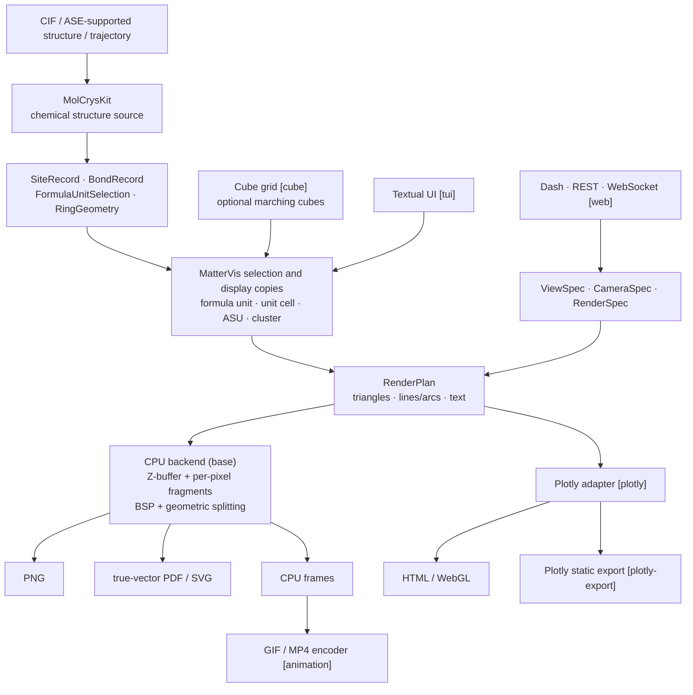

# MatterVis Architecture

MatterVis has one chemistry source and several explicitly selected output
frontends. The base installation owns the complete browser-independent static
path; an optional frontend may consume the same `RenderPlan`, but it may not
recompute chemical identity or silently replace another backend.

## Ownership

| Layer | Owns | Must not own |
|---|---|---|
| MolCrysKit | symmetry-expanded sites, molecule and ASU identity, PBC bonds, ADPs, rings, formula-unit selection | cameras, colors, output formats |
| MatterVis selection | which public records and periodic images are displayed | re-perceived bonds or private MolCrysKit `.info` fields |
| representation | ball-and-stick, space filling, wireframe, ORTEP, aromatic circle/disk | renderer selection |
| shading | smooth, flat, ORTEP axes/hatch | chemical topology or output format |
| camera | one homogeneous orthographic/perspective transform and clipping contract | chemistry or backend fallback |
| backend | CPU or Plotly conversion of an existing `RenderPlan` | changing representation or chemistry |
| encoder/frontend | HTML, Web service, TUI, GIF/MP4, Cube mesh extraction | implicit installation or backend switching |

ORTEP is a representation, `flat` is shading, and `cpu`/`plotly` are
backends. Those choices remain independent in both the Python contracts and
the CLI.

## Static rendering

Every visible object is compiled from the bottom up into backend-neutral
primitives. Atoms and ellipsoids become triangle meshes; bonds and polyhedron
surfaces become meshes and edge segments; aromatic circles and ORTEP hatches
become depth-tested line segments; labels remain text.

The PNG renderer keeps one global opaque Z-buffer and a per-pixel list of
transparent fragments. The PDF/SVG renderer clips and triangulates surfaces,
splits intersecting polygons with a BSP, and splits strokes at projected
occlusion boundaries before writing vector paths. An embedded full-page PNG
is not a vector backend.

## Dependency direction

The base path may import only base dependencies. Optional modules are loaded
at the operation that needs them:

- Plotly HTML: `matter-vis[plotly]`;
- Plotly static export: `matter-vis[plotly-export]`;
- Dash, REST, and WebSocket: `matter-vis[web]`;
- Web/API screenshots and the Web UI's Plotly static export:
  `matter-vis[plotly-export,web]` (requirements `web-screenshot` and
  `static-web-export`);
- terminal UI: `matter-vis[tui]`;
- Cube isosurfaces: `matter-vis[cube]`;
- GIF/MP4 encoding: `matter-vis[animation]`.

`mat-vis capabilities` and `mat-vis render --check` are the authoritative
dependency resolver. No skill or installer maintains a second dependency
table.
