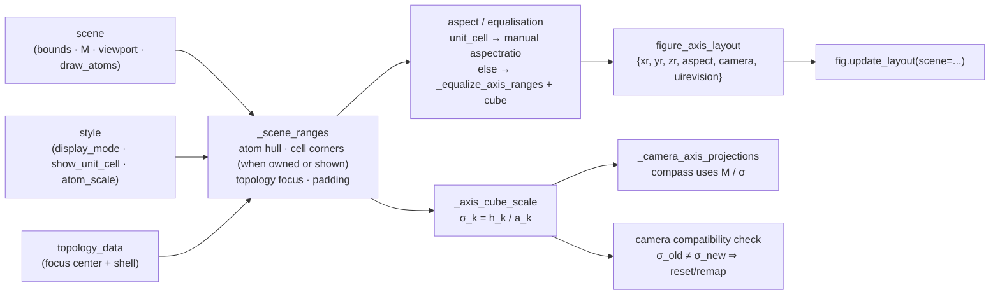
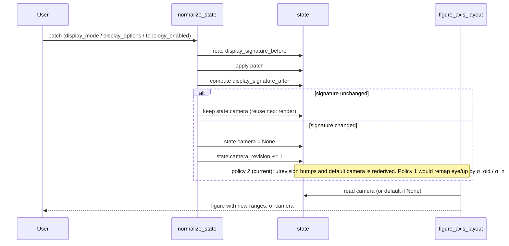

# Camera, Viewport, And Projection Derivations

This is the critical geometry note for the current display bugs.  Plotly 3D
does not render data coordinates directly: it first maps every data axis into a
normalized scene cube, then interprets `scene.camera` inside that normalized
space.  Therefore axis ranges, aspect mode, camera reuse, and compass
projection are one mathematical system.

The viewport pipeline below shows where the cube scale \(\vec\sigma\) is
produced and where every downstream consumer (layout, compass projection,
camera compatibility check) reads it.  All three consumers MUST agree on the
same \(\vec\sigma\) or the rendered scene drifts from the camera frame.

## Derivation

### Plotly Scene-Cube Model

Let the data axis range for coordinate \(k\in\{x,y,z\}\) be

\[
[r_k^\min,r_k^\max],
\qquad
\mu_k=\frac{r_k^\min+r_k^\max}{2},
\qquad
h_k=\frac{r_k^\max-r_k^\min}{2}.
\]

Plotly maps a data coordinate \(\vec x\) to scene-cube coordinates
\(\vec q\).  Up to a global constant that does not affect directions, the
mapping is

\[
q_k = \frac{x_k-\mu_k}{\sigma_k}.
\]

The scale \(\sigma_k\) is the data-units-per-rendered-cube-unit value.

For manual aspect ratio with aspect component \(a_k\),

\[
\sigma_k=\frac{h_k}{a_k}.
\]

For `aspectmode="cube"` after MatterVis equalizes all axis ranges, the rendered
cube is isotropic and

\[
\sigma_k=h_k.
\]

The reverse map is

\[
x_k=\mu_k+\sigma_kq_k.
\]

This means Plotly camera vectors live in cube space, not raw data space.  A
camera vector \(\vec d_q\) corresponds to a data-space direction

\[
\vec d_x = \vec d_q\odot\vec\sigma,
\]

where \(\odot\) is elementwise multiplication.

### Isometric Aspect Contract

MatterVis must preserve Cartesian distances in every rendered molecular scene.
That means one Angstrom along Cartesian x, y, and z must map to the same
rendered scene-cube length. In the notation above, the no-flattening invariant
is:

\[
\sigma_x=\sigma_y=\sigma_z.
\]

For `aspectmode="manual"`, this is enforced by deriving aspect components from
the final Cartesian axis half-spans:

\[
a_k=\frac{h_k}{\max_j h_j},
\qquad
\sigma_k=\frac{h_k}{a_k}=\max_j h_j.
\]

For `aspectmode="cube"`, MatterVis first equalizes the ranges so
\(h_x=h_y=h_z\), which gives the same invariant.

This is deliberately not the same as using lattice-vector lengths
\(\lVert M_{k,:}\rVert\) as Plotly aspect components. Plotly scales Cartesian
x/y/z axes, not lattice-vector directions. For skewed cells, padding, topology
overlays, or complete boundary molecules, lattice lengths and final Cartesian
axis ranges can diverge. The final range-derived aspect is the authoritative
anti-flattening contract.

### Axis Ranges

For molecule-focused views, start with the visible atom hull:

\[
\vec m_\mathrm{atom}
= \min_i(\vec x_i-\rho_i),
\qquad
\vec M_\mathrm{atom}
= \max_i(\vec x_i+\rho_i),
\]

where \(\rho_i\) is the atom radius after `atom_scale`.

Additional points may expand the hull:

- focus topology center and shell points;
- unit-cell corners \(0,\vec a,\vec b,\vec c,\vec a+\vec b,\vec a+\vec c,
  \vec b+\vec c,\vec a+\vec b+\vec c\);
- focused topology center and shell points.

The current policy is mode-dependent:

\[
\texttt{display\_mode}=\texttt{unit\_cell}
\Rightarrow
\text{cell corners own the base viewport}.
\]

\[
\texttt{show\_unit\_cell}
\Rightarrow
\text{cell corners are included as range extras in every display mode}.
\]

This separates the rendered atom set from viewport ownership. Unit-cell mode
may draw complete molecule images just outside the box so boundary fragments
remain chemically contiguous, but those outside images do not own the base
viewport. Otherwise the real unit cell can collapse into a thin strip inside an
oversized atom hull.

After the min/max hull is formed, MatterVis pads it:

\[
\mathrm{span}_k=\max(M_k-m_k,0.8),
\qquad
\mathrm{pad}_k=\max(0.06\,\mathrm{span}_k,0.25),
\]

and emits

\[
[r_k^\min,r_k^\max]=[m_k-\mathrm{pad}_k,\ M_k+\mathrm{pad}_k].
\]

For non-manual modes, `_equalize_axis_ranges` sets every axis span to the
largest span while preserving each axis midpoint:

\[
L = \max_k(r_k^\max-r_k^\min),
\qquad
[r_k^\min,r_k^\max]\leftarrow[\mu_k-L/2,\mu_k+L/2].
\]

### Camera Screen Basis

Given camera eye \(\vec e\), center \(\vec c\), and up vector \(\vec u\):

\[
\hat v=\frac{\vec c-\vec e}{\lVert\vec c-\vec e\rVert},
\]

\[
\hat r=
\frac{\hat v\times\vec u}{\lVert\hat v\times\vec u\rVert},
\qquad
\hat s=\hat r\times\hat v.
\]

The vectors \(\hat r\) and \(\hat s\) are orthonormal and lie in the screen
plane because both are perpendicular to \(\hat v\), and \(\hat s\) is the
Gram-Schmidt correction of the supplied up vector into the plane.

Any cube-space vector \(\vec v_q\) projects to screen components

\[
(\Delta_x,\Delta_y)=
(\vec v_q\cdot\hat r,\ \vec v_q\cdot\hat s).
\]

### Compass Paper Coordinates

Let a compass arrow have projected screen delta \((\Delta_x,\Delta_y)\).
Normalize the longest arrow to `pixel_length`:

\[
s_\mathrm{px} =
\frac{L_\mathrm{px}}
{\max_i\sqrt{\Delta_{x,i}^2+\Delta_{y,i}^2}}.
\]

For one arrow:

\[
dx_\mathrm{px}=s_\mathrm{px}\Delta_x,
\qquad
dy_\mathrm{px}=s_\mathrm{px}\Delta_y.
\]

With figure size \((W,H)\) and paper-coordinate anchor \((x_0,y_0)\), the
arrow head is

\[
x_\mathrm{tip}=x_0+\frac{dx_\mathrm{px}}{W},
\qquad
y_\mathrm{tip}=y_0+\frac{dy_\mathrm{px}}{H}.
\]

Plotly annotation tails use `axref="pixel"` / `ayref="pixel"` and pixel y grows
downward, so the tail offset is

\[
ax=-dx_\mathrm{px},\qquad ay=dy_\mathrm{px}.
\]

### Camera Remapping Across Aspect Changes

Suppose a rebuild changes the cube scale from \(\vec\sigma^{(o)}\) to
\(\vec\sigma^{(n)}\).  To preserve the same data-space view direction, do not
reuse the old cube vector unchanged.  If

\[
\vec d_q^{(o)}=\vec e_q^{(o)}-\vec c_q^{(o)},
\]

then the old data-space direction is

\[
\vec d_x=\vec d_q^{(o)}\odot\vec\sigma^{(o)}.
\]

The new cube-space direction that represents the same data direction is

\[
\vec d_q^{(n)}
=
\vec d_x\oslash\vec\sigma^{(n)}
=
\vec d_q^{(o)}
\odot
\left(\vec\sigma^{(o)}\oslash\vec\sigma^{(n)}\right).
\]

Thus

\[
\vec e_q^{(n)}
=
\vec c_q^{(n)}+\vec d_q^{(n)}.
\]

The camera `up` vector must be remapped by the same elementwise scale and then
renormalized:

\[
\vec u_q^{(n)}
=
\operatorname{normalize}
\left(
\vec u_q^{(o)}
\odot
\left(\vec\sigma^{(o)}\oslash\vec\sigma^{(n)}\right)
\right).
\]

If MatterVis does not remap, it must explicitly reset the camera when the cube
scale changes.

## Current Code Mapping

Default camera creation:

- `crystal_viewer/render/viewport.py:19-28` creates a Plotly camera from
  `scene["view_direction"]`, `scene["up"]`, and `camera_eye_distance`.

Aspect:

- `crystal_viewer/render/viewport.py:31-45` keeps a lattice-length summary
  helper for callers that need it.
- `crystal_viewer/render/viewport.py:48-64` derives manual Plotly aspect from
  final Cartesian axis ranges.
- `crystal_viewer/render/viewport.py:67-82` gates manual range aspect to
  `display_mode == "unit_cell"`.

Cube scale:

- `crystal_viewer/render/viewport.py:85-110` computes manual scale
  \(\sigma_k=h_k/a_k\).
- `crystal_viewer/render/viewport.py:137-170` falls back to viewport or
  bounds-derived scale for non-manual scenes.
- `crystal_viewer/render/viewport.py:129-133` divides lattice axes by this
  cube scale before projecting compass axes.

Ranges and equalization:

- `crystal_viewer/render/viewport.py:180-274` computes atom/topology/cell
  axis ranges.
- `crystal_viewer/render/viewport.py:219-239` includes unit-cell corners only
  when `cell_owns_cube` is true.
- `crystal_viewer/render/viewport.py:240-252` includes focused topology in
  the range but excludes `extra_overlays` from viewport ownership.
- `crystal_viewer/render/viewport.py:277-304` equalizes axis ranges to the
  longest span.
- `crystal_viewer/render/viewport.py:307-331` writes the final Plotly
  `layout.scene`: axis ranges, camera, `uirevision`, background, and either
  manual aspect or cube aspect.

Figure assembly:

- `crystal_viewer/renderer/core.py:116-118` calls `_scene_ranges` before building
  traces.
- `crystal_viewer/renderer/core.py:201` installs `figure_axis_layout`.
- `crystal_viewer/render/traces_overlays.py` draws the full unit-cell
  box from the eight lattice corners whenever `scene["M"]` exists; visibility
  is controlled later by style.

Camera persistence and overwrite:

- `crystal_viewer/app/backend_camera.py` excludes compatible `camera` from
  the figure cache key.
- `crystal_viewer/app/backend_camera.py` applies the live camera on cached
  and freshly built figures.

Compass:

- `crystal_viewer/compass/core.py:46-87` implements the screen basis.
- `crystal_viewer/compass/core.py:90-102` projects 3D vectors onto that basis.
- `crystal_viewer/compass/core.py:171-190` normalizes arrows to pixels and flips the
  tail sign for Plotly pixel-y semantics.
- `crystal_viewer/render/compass.py:74-110` caps baked compass arrows so they
  stay inside the figure edge.
- `crystal_viewer/render/compass.py:155-168` emits the same paper/pixel
  arrow structure as the lower-level compass helper.
- `frontend/assets/mattervis.js` renders the interactive Dash
  compass into a sibling SVG. Normal redraws use the committed
  `layout.scene.camera`; only active drag polling reads Plotly's internal
  `intScene.getCamera()`.

## Audit Notes

### Bug 1: ASU / Formula Cell Box Is Incomplete

The fixed contract is that a visible unit-cell wireframe must have its eight
corners represented in the viewport calculation. The wireframe always draws the
full lattice parallelepiped from

\[
\{0,\vec a,\vec b,\vec c,\vec a+\vec b,\vec a+\vec c,\vec b+\vec c,
\vec a+\vec b+\vec c\}.
\]

That is implemented in `crystal_viewer/render/traces_overlays.py`.

but let `_scene_ranges` omit those corners in non-unit-cell modes. If a lattice
corner \(C\) satisfied

\[
\lvert C_k-\mu_k\rvert > L/2
\]

for any equalized axis center \(\mu_k\) and half-span \(L/2\), Plotly clipped
the wireframe.

The repair is:

\[
\texttt{show\_unit\_cell}\Rightarrow
\text{include eight cell corners in range extras}.
\]

Topology `extra_overlays` are visual annotations for other replicas; they do
not own the main viewport.

### Bug 2: Unit Cell Can Be Flattened By Outside Complete Fragments

Unit-cell mode can draw complete molecules outside the box to avoid chopped
boundary fragments. If the range hull is computed from all drawn atoms, then an
outside image at Cartesian position \(x_o\) can make:

\[
\max_i x_i-\min_i x_i \gg \max_\text{cell} x-\min_\text{cell} x.
\]

Even if the later aspect formula is isometric, the visible cell becomes tiny in
an oversized viewport and looks flattened. The unit-cell viewport therefore
starts from the eight cell corners and excludes both outside complete molecule
images and topology extra overlays from ownership. They may still render; they
just do not define the base viewport.

### Bug 3: Display Changes Can Squish The View

When display mode changes, the figure is rebuilt with a new range/aspect
normalization.  The code then reapplies the stored camera cube vector without
remapping:

\[
\vec e_q^{(n)} := \vec e_q^{(o)}.
\]

But the same cube vector corresponds to the new data-space direction

\[
\vec d_x^{(n)}
=
\vec d_q^{(o)}\odot\vec\sigma^{(n)},
\]

not the old direction

\[
\vec d_x^{(o)}
=
\vec d_q^{(o)}\odot\vec\sigma^{(o)}.
\]

The apparent data-space view is therefore scaled componentwise by

\[
\vec\sigma^{(n)}\oslash\vec\sigma^{(o)}.
\]

That is a formula-level explanation for the perceived flattening or
non-uniform stretch after changing display settings.  It is not a second
`aspectratio` write.  The Python path has one layout writer
(`figure_axis_layout`) and then one camera overwrite
(`fig.update_layout(scene_camera=camera)`).

The implementation already knows how to scale lattice vectors into cube space
for the compass (`render/viewport.py:129-133`).  The missing piece is applying
the same old/new cube-scale reasoning to the camera itself when the viewport
signature changes.

The current reducer follows policy 2 (clear + revision bump).
`normalize_state` watches a `display_signature` tuple
`(display_mode, "unit_cell_box" in display_options, topology_enabled)` and on
any change drops `state["camera"]` to `None` and increments
`state["camera_revision"]`:

### Viewport Math Ownership

The renderer split leaves `_scene_ranges`, `_axis_cube_scale`, and
`uniform_viewport` in `render/viewport.py`.  `render/scene_traces.py` is now
a compatibility facade, so new viewport math must go directly into
`render/viewport.py` and trace modules must consume it rather than defining
shadow helpers.

## Invariants

- Axis ranges, aspect mode, aspect ratio, and initial camera belong to one
  layout calculation: `figure_axis_layout`.
- Final layout must preserve Cartesian data-unit scale:
  \(\sigma_x=\sigma_y=\sigma_z\). For manual aspect, this means
  \(h_x/a_x=h_y/a_y=h_z/a_z\); for cube aspect, ranges must be equalized first.
- A stored Plotly camera is a scene-cube camera.  It may be reused across a
  rebuild only if the cube scale is unchanged or if the camera is remapped by
  \(\vec\sigma^{(o)}\oslash\vec\sigma^{(n)}\).
- If camera remapping is not implemented, display changes that alter
  \(\vec\sigma\) must reset or revision-bump the camera.
- The compass must project lattice vectors after converting them with the same
  cube scale that the main scene uses.
- The interactive compass must use the committed Plotly layout camera after
  Dash figure rebuilds. Plotly's internal live camera is valid for drag-frame
  polling only; using it after scope/polyhedra rebuilds can leave the compass
  on a stale orientation.
- If `show_unit_cell=True`, the range policy must explicitly say whether the
  full cell owns the viewport.  Drawing a full cell while excluding its corners
  from the range is a clipping contract, not an accidental visual effect.
- Topology focus points and topology extra overlays are separate viewport
  concepts. Extra overlay replicas are annotations and must not grow the main
  viewport in any display mode.

