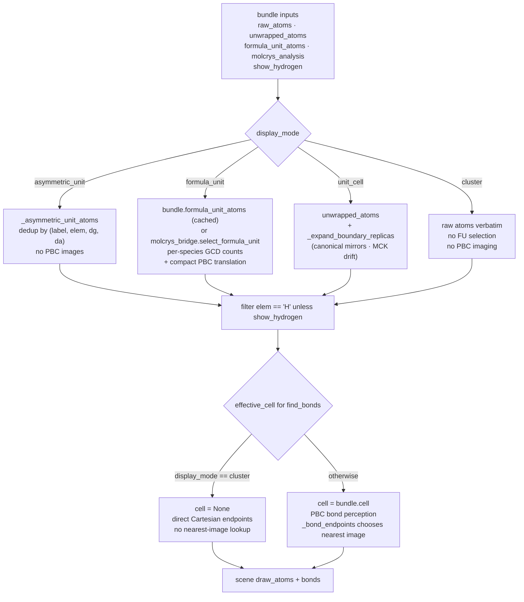

# Display Mode Geometry

Display modes decide which atom images are materialized and how bonds choose
their endpoints.  They must not change the lattice convention: the scene keeps
the same row-vector `M` unless a transform explicitly replaces the cell.

The four modes branch from the same loader inputs and converge again at the
hydrogen filter and bond-detection step:

The `cluster` branch is intentionally a short-circuit: it skips formula-unit
stoichiometry and PBC bond imaging entirely, because the stored Cartesian
coordinates are already the final geometry.

## Derivation

Let the raw atom set be

\[
A=\{a_i\}_{i=1}^N,
\]

with each atom carrying Cartesian coordinate \(\vec x_i\), fractional
coordinate \(\vec f_i\), label, element, and disorder metadata.

### Asymmetric Unit

The asymmetric-unit view is a representative-site view.  It keeps the first
atom for each key

\[
K_i = (\mathrm{label}_i,\mathrm{elem}_i,\mathrm{dg}_i,\mathrm{da}_i),
\]

and discards later atoms with an already-seen key.  No periodic image is
generated and no molecule completion is implied.

### Formula Unit

The formula-unit view is a molecule-level stoichiometric selection.  Let
MolCrysKit partition raw atoms into molecules \(m_j\), assign species
\(s(m_j)\), and compute the simplest unit counts \(q_s\) by dividing species
counts by their greatest common divisor.  MatterVis then chooses \(q_s\)
molecules for every species \(s\).

The selected molecules are translated by integer fractional vectors so the
formula unit stays spatially compact.  If a molecule centroid is
\(\vec p_m\) and the current anchor centroid is \(\vec p_0\), choose

\[
\vec n^* = \arg\min_{\vec n\in[-2,2]^3\cap\mathbb{Z}^3}
\lVert \vec p_m + \vec nM - \vec p_0\rVert.
\]

Every atom in that molecule receives the same translation:

\[
\vec x_i' = \vec x_i + \vec n^*M,
\qquad
\vec f_i' = \vec x_i'M^{-1}.
\]

### Cluster

The cluster view treats stored Cartesian coordinates as already final.  It does
not complete periodic images, select formula-unit stoichiometry, or use PBC
when drawing bonds.

### Unit Cell Boundary Replicas

The unit-cell view starts from continuous molecule coordinates and adds display
replicas for atoms or whole fragments that sit on crystallographic cell
boundaries.

For one fractional coordinate \(f_k\) and tolerance \(\tau\), define the
canonical per-axis mirror-shift set

\[
S_k(f_k;\tau)=
\begin{cases}
\{0,1\}, & -\tau \le f_k \le \tau,\\
\{0,-1\}, & 1-\tau \le f_k \le 1+\tau,\\
\{0\}, & \text{otherwise}.
\end{cases}
\]

The 3D shift set for an atom is the Cartesian product

\[
S(\vec f;\tau)=S_a(f_a;\tau)\times S_b(f_b;\tau)\times S_c(f_c;\tau).
\]

Atom-level boundary replicas use a strict tolerance
\(\tau_\mathrm{atom}=10^{-3}\).  Fragment-level face replicas also use the
centroid of wrapped fractional coordinates with a looser visual tolerance
\(\tau_\mathrm{frag}=3\times 10^{-2}\).  This fills whole fragments sitting
near a face without treating an arbitrary molecule crossing a boundary as a
duplicate.

MolCrysKit may unwrap a boundary molecule to a different periodic image so its
atoms are contiguous.  Let

\[
\bar{\vec f}_\mathrm{wrapped}
= \frac1m\sum_i \vec f_{i,\mathrm{wrapped}},
\qquad
\bar{\vec f}_\mathrm{mck}
= \frac1m\sum_i \vec f_{i,\mathrm{mck}}.
\]

The integer drift from canonical wrapped space to the MolCrysKit home image is

\[
\vec d =
\left\lfloor
\bar{\vec f}_\mathrm{mck}-\bar{\vec f}_\mathrm{wrapped}
+ \frac12
\right\rfloor .
\]

For a molecule-level canonical mirror shift \(\vec s\), the Cartesian shift
that must be applied to the already-unwrapped MolCrysKit coordinates is

\[
\vec s_\mathrm{effective} = \vec s-\vec d.
\]

If \(\vec d\notin S_\mathrm{mol}\), the current MCK home image is not one of
the canonical boundary mirror images.  Replicating would create a duplicate
for a merely wrapped molecule, so no canonical boundary replica is added.

Disorder/PART fragments have an additional display-space face pass: if a
disordered fragment's displayed centroid sits near a face, add those face
shifts directly.  This keeps alternate disorder orientations adjacent near the
cell boundary.

### Bond Endpoints

For a bond \(i,j\), MatterVis chooses a start point

\[
\vec p_i = \vec x_i.
\]

In `formula_unit`, `cluster`, and already-unwrapped molecule pairs, the end
point is the direct Cartesian position

\[
\vec p_j = \vec x_j.
\]

Otherwise, the end point is the nearest periodic image of atom \(j\) relative
to atom \(i\):

\[
\vec p_j =
\vec x_j + \vec n^*M,
\quad
\vec n^* =
\arg\min_{\vec n\in\mathbb{Z}^3}
\lVert \vec x_j+\vec nM-\vec x_i\rVert.
\]

## Current Code Mapping

Mode dispatch is centralized in `_selected_atoms_for_mode`:

- `crystal_viewer/scene/core.py:200-223` handles `unit_cell`,
  `asymmetric_unit`, `cluster`, and the default `formula_unit`.
- `crystal_viewer/loader/core.py:625-637` passes `bundle.formula_unit_atoms` only
  when `display_mode == "formula_unit"` and passes `bundle.unwrapped_atoms`
  for continuous molecule coordinates.

The asymmetric-unit key is implemented directly:

- `crystal_viewer/scene/core.py:134-148` keeps the first atom for
  `(label, elem, dg, da)`.

Formula-unit chemistry and compact translation are delegated to MolCrysKit:

- `crystal_viewer/structure/molcrys_bridge.py:250-302` builds a `CrystalAnalysis` from
  MolCrysKit molecule identification and stoichiometry.
- `crystal_viewer/structure/molcrys_bridge.py:362-371` describes the greedy selection:
  anchor on the heaviest species and select proximity-first molecules for the
  remaining per-FU counts.
- `crystal_viewer/structure/molcrys_bridge.py:311-324` computes the best integer PBC
  translation around the anchor.
- `crystal_viewer/structure/molcrys_bridge.py:327-340` applies that translation to every
  atom in the molecule and recomputes fractional coordinates.
- `crystal_viewer/structure/molcrys_bridge.py:416-444` updates the running anchor
  centroid after adding each selected molecule.

Cluster mode is intentionally direct:

- `crystal_viewer/scene/core.py:212-216` returns the stored atoms as Cartesian
  cluster atoms.
- `crystal_viewer/scene/core.py:519-520` passes `cell=None` to bond detection only
  for `display_mode == "cluster"`.

Unit-cell boundary replicas are implemented by `_expand_boundary_replicas`:

- `crystal_viewer/scene/core.py:264-290` defines the per-axis canonical shift sets
  and their Cartesian product.
- `crystal_viewer/scene/core.py:292-299` applies the strict atom-level tolerance.
- `crystal_viewer/scene/core.py:301-322` unions atom-level exact shifts with the
  looser fragment-centroid face shifts.
- `crystal_viewer/scene/core.py:360-384` computes the MolCrysKit drift vector
  by rounding centroid differences.
- `crystal_viewer/scene/core.py:399-435` applies the drift-corrected effective
  shifts to grouped molecules.
- `crystal_viewer/scene/core.py:437-451` applies atom-level replicas for atoms that
  do not have a MolCrysKit molecule index.

Bond endpoint policy is implemented by `_bond_endpoints`:

- `crystal_viewer/scene/core.py:455-463` uses direct endpoints for formula-unit,
  cluster, and already-unwrapped pairs, otherwise delegates to the legacy
  nearest-PBC-image helper.
- `crystal_viewer/scene/core.py:522-544` stores those endpoints on each bond.

## Audit Notes

Display mode is currently more than a pure selector.  It affects atom
materialization, bond perception, endpoint imaging, bounds, topology index
validity, and cache keys.  A redesign should separate those concerns:

- **selection**: which raw atoms or molecule images are active;
- **manifestation**: which Cartesian copies are drawn;
- **connectivity**: which bond graph is authoritative;
- **viewport policy**: which geometry owns the axis ranges.

`unit_cell` boundary replicas mix exact crystallographic special-position
logic with visual fragment-face heuristics.  The drift formula makes that
work, but it is subtle: replacing it with per-atom image shifts would recreate
orphan fragments at cell faces.

`formula_unit` relies on MolCrysKit's molecule graph and stoichiometry.  It
must not fall back to MatterVis-local PBC bond perception for molecule
identity; that is the failure mode documented in `AGENTS.md`.

The lattice `M` is preserved across display modes.  The incomplete cell-box
bug discussed in `camera.md` is therefore not caused by a truncated `M`; it is
caused by viewport ranges that omit the full cell corners while the full cell
wireframe is still drawn.

## Invariants

- `display_mode` never mutates `M`; it only changes selected/materialized
  atoms and bond endpoint policy.
- `formula_unit` molecule grouping and per-FU counts come from MolCrysKit.
- `cluster` bonds are Euclidean bonds in manifested Cartesian coordinates.
- `unit_cell` boundary replicas are whole-fragment replicas whenever a
  MolCrysKit molecule index is present.
- The drift-corrected shift is `canonical_shift - mck_drift`; skipping the
  case `mck_drift not in canonical_shifts` is required to avoid duplicating
  ordinary boundary-crossing molecules.
- Bond endpoint imaging must be explicit in the display policy.  It should not
  be hidden inside a generic renderer pass.

