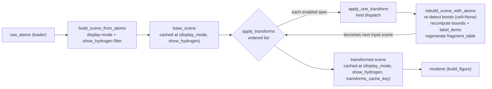
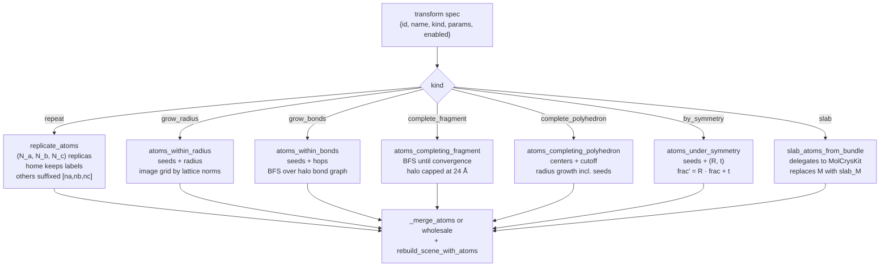

# Scene Transform Derivations

Transforms operate on manifested scene atoms.  They are composed in list order:

\[
S_{k+1}=T_k(S_k).
\]

The base scene comes from the display-mode selector; each transform returns a
new scene-like dict whose atom list, bonds, bounds, labels, and fragment table
are rebuilt for the manifested Cartesian coordinates.

The end-to-end pipeline from parsed atoms to a rendered figure is:

The base-scene cache key omits the transform list so toggling transforms
on/off never re-runs display-mode selection; the post-transform cache key adds
`transforms_cache_key(transforms)` so a row rename or `enabled=False` flip
hits without rebuilding geometry.

## Derivation

### Common Image Translation

For any integer image shift

\[
\vec n=(n_a,n_b,n_c)\in\mathbb{Z}^3,
\]

the Cartesian translation is

\[
\Delta\vec x(\vec n)=\vec nM
= n_a\vec a+n_b\vec b+n_c\vec c.
\]

An atom image is

\[
\vec x_i^{(\vec n)}=\vec x_i+\Delta\vec x(\vec n),
\qquad
\vec f_i^{(\vec n)}=\vec f_i+\vec n.
\]

The image shift is stored as metadata so later merging, labels, and tooltips
can distinguish home atoms from replicas.

### Repeat

For supercell counts \((N_a,N_b,N_c)\), clamp every count to at least 1 and
materialize

\[
\{a_i^{(n_a,n_b,n_c)}:
0\le n_a<N_a,\,
0\le n_b<N_b,\,
0\le n_c<N_c\}.
\]

The home image \((0,0,0)\) keeps its original labels.  Non-home labels get an
image suffix.

### Periodic Radius Growth

Given seed indices \(I\) and radius \(r\), include every periodic image whose
position is within \(r\) of any seed home position:

\[
\min_{s\in I}
\left\lVert
\vec x_i+\vec nM-\vec x_s
\right\rVert
\le r.
\]

MatterVis searches a finite image grid.  For each lattice direction \(k\),
with vector length \(\ell_k=\lVert M_{k,:}\rVert\), the half-width is

\[
N_k =
\min\left(
N_\max,
\max\left(1,
\left\lceil\frac{r+\ell_k}{\ell_k}\right\rceil
\right)
\right).
\]

The candidate grid is

\[
[-N_a,N_a]\times[-N_b,N_b]\times[-N_c,N_c].
\]

This deliberately overshoots: an atom offset inside the source cell can still
fall inside the sphere even when the image-cell origin is farther than \(r\).

Duplicates are removed by source label plus image shift.

### Bond Growth

Bond growth is graph expansion over a radius-limited candidate set.

1. Build a candidate halo with radius
   \[
   r_\mathrm{halo}=3.5\,\text{Å}\times\max(1,h),
   \]
   where \(h\) is the requested hop count.
2. Detect bonds in the manifested candidate coordinates without PBC.
3. Start from seed nodes in the home image.
4. Run breadth-first search for \(h\) layers.

The result is every candidate node whose graph distance from a seed is at most
\(h\).

### Complete Fragment

Fragment completion is the same graph idea with a larger hop budget.  A halo is
constructed with

\[
r_\mathrm{halo} = \min(3.5\,\text{Å}\times h_\max,\,24\,\text{Å}),
\]

then BFS walks until convergence or `max_hops`.  The 24 Å cap prevents runaway
periodic candidates while still allowing wrapped organic fragments to close.

When the seed set already covers every atom in the scene, completion is the
identity on the home image; growing a full scene by a huge halo would be a
performance bug, not a geometry feature.

### Complete Polyhedron

Polyhedron completion is radius growth around center seeds:

\[
\min_{s\in I}
\left\lVert
\vec x_i+\vec nM-\vec x_s
\right\rVert
\le r_\mathrm{cutoff}.
\]

It is geometry-only.  Chemistry-aware shell typing lives in
`crystal_viewer.topology` and MolCrysKit, not in this transform.

### Symmetry Images

A symmetry operation is supplied in fractional coordinates as

\[
(\mathcal R,\vec t).
\]

For a seed atom with fractional row vector \(\vec f\), the current
implementation applies

\[
\vec f' = \mathcal R\vec f + \vec t,
\qquad
\vec x'=\vec f'M.
\]

Because \(\vec f\) is conceptually a row vector elsewhere in MatterVis, this
formula is a code-level convention worth auditing.  The mathematical row-vector
form would usually be

\[
\vec f' = \vec f\mathcal R^\top+\vec t.
\]

The present API must therefore document whether supplied \(\mathcal R\) is
already transposed for the implementation.  Until that is clarified, symmetry
ops are a boundary-sensitive transform.

### Slab

The slab transform delegates crystallographic slab generation to MolCrysKit:

\[
(A_\mathrm{slab},M_\mathrm{slab})
= \mathrm{generate\_topological\_slab}
(A,M,hkl,\text{layers},\text{thickness},\text{vacuum}).
\]

MatterVis then rebuilds the scene with the returned atom coordinates and
replaces the lattice by \(M_\mathrm{slab}\).  This is the only transform in the
current list that is expected to replace `M`.

### Transform Kinds Overview

The seven recognised `kind` values share the same dispatch and merge path; they
differ only in which seed/parameter rule produces the extra atoms (or, for
`slab`, the wholesale replacement set).

`transforms_cache_key` hashes only the geometry-affecting fields per spec
(`kind`, `enabled`, sorted `params` keys).  `id` and `name` are intentionally
excluded so a row rename hits the cache; flipping `enabled` re-keys but the
disabled spec is skipped inside `apply_transforms` itself.

## Current Code Mapping

The transform API and kind list are declared in:

- `crystal_viewer/transforms.py:1-80`, including the transform spec schema.
- `crystal_viewer/transforms.py:104-115`, the recognized kind tuple.

Common image translation:

- `crystal_viewer/transforms.py:202-205` converts an image shift to Cartesian
  translation with `frac_to_cart`.
- `crystal_viewer/transforms.py:178-199` copies atom dictionaries and records
  `_image_shift` / `_origin_label`.

Repeat:

- `crystal_viewer/transforms.py:208-239` loops over all non-negative image
  shifts, translates `cart`, increments `frac`, and suffixes non-home labels.
- `crystal_viewer/transforms.py:719-724` clamps repeat counts to at least 1.

Radius growth:

- `crystal_viewer/transforms.py:242-267` computes the finite image grid.
- `crystal_viewer/transforms.py:270-318` evaluates pairwise distances from
  shifted candidates to seed atoms and deduplicates by label and shift.

Bond growth:

- `crystal_viewer/transforms.py:321-387` builds the radius halo, detects bonds,
  and runs BFS for `hops` layers.

Fragment completion:

- `crystal_viewer/transforms.py:390-462` uses the capped halo, detects bonds,
  and BFS-walks until convergence or `max_hops`.
- `crystal_viewer/transforms.py:416-417` short-circuits the all-atoms seed case.

Polyhedron completion:

- `crystal_viewer/transforms.py:465-487` delegates to `atoms_within_radius`
  with `include_seeds=True`.

Symmetry:

- `crystal_viewer/transforms.py:490-531` converts each selected atom to
  fractional coordinates, applies `new_frac = R_arr @ frac + t_arr`, and
  converts back with `frac_to_cart`.

Slab:

- `crystal_viewer/transforms.py:539-597` calls
  `molcrys_kit.operations.surface.generate_topological_slab`, returns
  MatterVis-shaped atoms, and extracts `slab_M`.
- `crystal_viewer/transforms.py:824-854` rebuilds the scene with both
  `cell_override` and `M_override`.

Scene rebuild and composition:

- `crystal_viewer/transforms.py:605-716` rebuilds bonds, labels, bounds, and
  projected axes after atom coordinates change.
- `crystal_viewer/transforms.py:727-856` dispatches a single transform kind.
- `crystal_viewer/transforms.py:887-925` composes enabled transforms in list
  order and records `_transform_lineage`.
- `crystal_viewer/loader.py:672-715` caches transformed scenes by
  `(display_mode, show_hydrogen, transforms_cache_key(transforms))` and
  rebuilds fragment tables from the transformed atom list.

## Audit Notes

Most transforms operate in manifested Cartesian space after the display-mode
selection has already happened.  That is useful for rendering but couples
transform semantics to the input display mode.  For example, repeating a
formula-unit scene repeats the selected formula unit, not the raw unit cell.
That may be what the UI wants, but it should be an explicit state-machine
choice rather than an accident of callback order.

The symmetry transform uses `R_arr @ frac` while the rest of the system treats
fractional coordinates as row vectors.  This may be correct if the API expects
column-vector operation matrices, but then the transform is a convention
boundary and must say so.  A redesign should normalize symmetry op conventions
at input time.

`rebuild_scene_with_atoms` re-detects bonds with `cell=None` because transformed
atoms are already manifested in one Cartesian frame.  That is correct for
repeat/grow/complete operations, but it means transformed connectivity is not
the same object as MolCrysKit's unit-cell molecule graph.

Slab generation properly stays upstream in MolCrysKit.  MatterVis should add
passthrough parameters when needed, not duplicate slab geometry.

## Invariants

- Transform pipelines compose in list order and operate on the previous scene's
  manifested atoms.
- `repeat` keeps the home-cell labels unchanged.
- Image shifts are integer fractional row vectors; Cartesian translations are
  `shift @ M`.
- Growth transforms deduplicate by original atom identity plus image shift.
- After any transform that changes atoms, the scene must be rebuilt: bonds,
  bounds, labels, projected axes, and fragment tables cannot be reused.
- Only `slab` replaces `M` in the current transform set.
- Symmetry operation matrix convention must be documented at the API boundary;
  code should not silently mix row-vector and column-vector forms.

