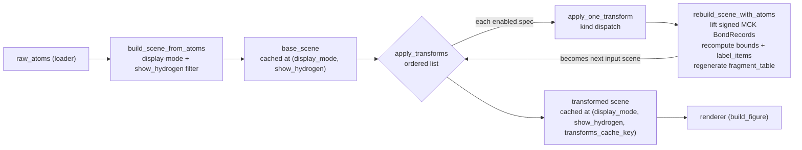
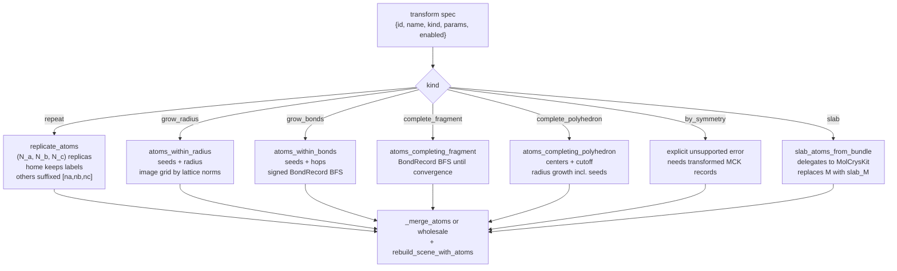

# Scene Transform Derivations

Transforms operate on manifested scene atoms.  They are composed in list order:

\[
S_{k+1}=T_k(S_k).
\]

The base scene comes from the display-mode selector; each transform returns a
new scene-like dict whose atom list, bonds, bounds, labels, and fragment table
are rebuilt for the manifested Cartesian coordinates.

The end-to-end pipeline from parsed atoms to a rendered figure is:

```mermaid
flowchart LR
    A["raw_atoms (loader)"] --> B["build_scene_from_atoms<br/>display-mode + show_hydrogen filter"]
    B --> C["base_scene<br/>cached at (display_mode, show_hydrogen)"]
    C --> D{"apply_transforms<br/>ordered list"}
    D -->|"each enabled spec"| E["apply_one_transform<br/>kind dispatch"]
    E --> F["rebuild_scene_with_atoms<br/>lift signed MCK BondRecords<br/>recompute bounds + label_items<br/>regenerate fragment_table"]
    F -->|"becomes next input scene"| D
    D --> G["transformed scene<br/>cached at (display_mode, show_hydrogen, transforms_cache_key)"]
    G --> H["renderer (build_figure)"]
```

The base-scene cache key omits the transform list so toggling transforms
on/off never re-runs display-mode selection; the post-transform cache key adds
`transforms_cache_key(transforms)` so a row rename or `enabled=False` flip
hits without rebuilding geometry.

## Derivation

### Common Image Translation

For any integer image shift

\[
\vec n=(n_a,n_b,n_c)\in\mathbb{Z}^3,
\]

the Cartesian translation is

\[
\Delta\vec x(\vec n)=\vec nM
= n_a\vec a+n_b\vec b+n_c\vec c.
\]

An atom image is

\[
\vec x_i^{(\vec n)}=\vec x_i+\Delta\vec x(\vec n),
\qquad
\vec f_i^{(\vec n)}=\vec f_i+\vec n.
\]

The image shift is stored as metadata so later merging, labels, and tooltips
can distinguish home atoms from replicas.

### Repeat

For supercell counts \((N_a,N_b,N_c)\), clamp every count to at least 1 and
materialize

\[
\{a_i^{(n_a,n_b,n_c)}:
0\le n_a<N_a,\,
0\le n_b<N_b,\,
0\le n_c<N_c\}.
\]

The home image \((0,0,0)\) keeps its original labels.  Non-home labels get an
image suffix.

### Periodic Radius Growth

Given seed indices \(I\) and radius \(r\), include every periodic image whose
position is within \(r\) of any seed home position:

\[
\min_{s\in I}
\left\lVert
\vec x_i+\vec nM-\vec x_s
\right\rVert
\le r.
\]

MatterVis searches a finite image grid.  For each lattice direction \(k\),
with vector length \(\ell_k=\lVert M_{k,:}\rVert\), the half-width is

\[
N_k =
\min\left(
N_\max,
\max\left(1,
\left\lceil\frac{r+\ell_k}{\ell_k}\right\rceil
\right)
\right).
\]

The candidate grid is

\[
[-N_a,N_a]\times[-N_b,N_b]\times[-N_c,N_c].
\]

This deliberately overshoots: an atom offset inside the source cell can still
fall inside the sphere even when the image-cell origin is farther than \(r\).

Duplicates are removed by SiteRecord global index plus image shift.

### Bond Growth

Bond growth is graph expansion over MolCrysKit's signed BondRecords. For a
record `(left, right, S)`, the periodic graph contains both directed edges

\[
(left,\vec q)\rightarrow(right,\vec q+\vec S),\qquad
(right,\vec q)\rightarrow(left,\vec q-\vec S).
\]

A breadth-first walk of at most \(h\) edges materialises only those exact
source/image identities. No distance cutoff or local bond detector participates.

### Complete Fragment

Fragment completion uses the same signed-record graph with a larger hop budget
and stops at convergence or `max_hops`. Periodic frameworks can still grow
without bound, so the global transformed-atom ceiling remains the safety guard.

### Complete Polyhedron

Polyhedron completion is radius growth around center seeds:

\[
\min_{s\in I}
\left\lVert
\vec x_i+\vec nM-\vec x_s
\right\rVert
\le r_\mathrm{cutoff}.
\]

It is geometry-only.  Chemistry-aware shell typing lives in
`mat_viewer.topology` and MolCrysKit, not in this transform.

### Symmetry Images

The strict public pipeline rejects `by_symmetry`. An arbitrary operation must
produce a new MolCrysKit SiteRecord/BondRecord contract; an operation number is
not a lattice image shift and cannot safely reuse the source bond graph.

### Slab

The slab transform delegates crystallographic slab generation to MolCrysKit:

\[
(A_\mathrm{slab},M_\mathrm{slab})
= \mathrm{generate\_topological\_slab}
(A,M,hkl,\text{layers},\text{thickness},\text{vacuum}).
\]

MatterVis then rebuilds the scene with the returned atom coordinates and
replaces the lattice by \(M_\mathrm{slab}\).  This is the only transform in the
current list that is expected to replace `M`.

### Transform Kinds Overview

The seven recognised `kind` values share the same dispatch and merge path; they
differ only in which seed/parameter rule produces the extra atoms (or, for
`slab`, the wholesale replacement set).

```mermaid
flowchart TD
    P["transform spec<br/>{id, name, kind, params, enabled}"] --> K{"kind"}
    K -->|"repeat"| R["replicate_atoms<br/>(N_a, N_b, N_c) replicas<br/>home keeps labels<br/>others suffixed [na,nb,nc]"]
    K -->|"grow_radius"| GR["atoms_within_radius<br/>seeds + radius<br/>image grid by lattice norms"]
    K -->|"grow_bonds"| GB["atoms_within_bonds<br/>seeds + hops<br/>signed BondRecord BFS"]
    K -->|"complete_fragment"| CF["atoms_completing_fragment<br/>BondRecord BFS until convergence"]
    K -->|"complete_polyhedron"| CP["atoms_completing_polyhedron<br/>centers + cutoff<br/>radius growth incl. seeds"]
    K -->|"by_symmetry"| BS["explicit unsupported error<br/>needs transformed MCK records"]
    K -->|"slab"| SL["slab_atoms_from_bundle<br/>delegates to MolCrysKit<br/>replaces M with slab_M"]
    R --> MG["_merge_atoms or wholesale<br/>+ rebuild_scene_with_atoms"]
    GR --> MG
    GB --> MG
    CF --> MG
    CP --> MG
    BS --> MG
    SL --> MG
```

`transforms_cache_key` hashes only the geometry-affecting fields per spec
(`kind`, `enabled`, sorted `params` keys).  `id` and `name` are intentionally
excluded so a row rename hits the cache; flipping `enabled` re-keys but the
disabled spec is skipped inside `apply_transforms` itself.

## Current Code Mapping

The transform API and kind list are declared in:

- `mat_viewer/transforms/core.py:1-80`, including the transform spec schema.
- `mat_viewer/transforms/core.py:104-115`, the recognized kind tuple.

Common image translation:

- `mat_viewer/transforms/core.py:202-205` converts an image shift to Cartesian
  translation with `frac_to_cart`.
- `mat_viewer/transforms/core.py:178-199` copies atom dictionaries and records
  `_image_shift` / `_origin_label`.

Repeat:

- `mat_viewer/transforms/core.py:208-239` loops over all non-negative image
  shifts, translates `cart`, increments `frac`, and suffixes non-home labels.
- `mat_viewer/transforms/core.py:719-724` clamps repeat counts to at least 1.

Radius growth:

- `mat_viewer/transforms/core.py:242-267` computes the finite image grid.
- `mat_viewer/transforms/core.py:270-318` evaluates pairwise distances from
  shifted candidates to seed atoms and deduplicates by label and shift.

Bond growth and fragment completion:

- `_walk_record_graph` validates SiteRecord/BondRecord payloads and walks their
  signed periodic graph without invoking local chemistry.

Polyhedron completion:

- `mat_viewer/transforms/core.py:465-487` delegates to `atoms_within_radius`
  with `include_seeds=True`.

Symmetry:

- `mat_viewer/transforms/core.py:490-531` converts each selected atom to
  fractional coordinates, applies `new_frac = R_arr @ frac + t_arr`, and
  converts back with `frac_to_cart`.

Slab:

- `mat_viewer/transforms/core.py:539-597` calls
  `molcrys_kit.operations.surface.generate_topological_slab`, returns
  MatterVis-shaped atoms, and extracts `slab_M`.
- `mat_viewer/transforms/core.py:824-854` rebuilds the scene with both
  `cell_override` and `M_override`.

Scene rebuild and composition:

- `mat_viewer/transforms/core.py:605-716` rebuilds bonds, labels, bounds, and
  projected axes after atom coordinates change.
- `mat_viewer/transforms/core.py:727-856` dispatches a single transform kind.
- `mat_viewer/transforms/core.py:887-925` composes enabled transforms in list
  order and records `_transform_lineage`.
- `mat_viewer/loader/core.py:672-715` caches transformed scenes by
  `(display_mode, show_hydrogen, transforms_cache_key(transforms))` and
  rebuilds fragment tables from the transformed atom list.

## Audit Notes

Most transforms operate in manifested Cartesian space after the display-mode
selection has already happened.  That is useful for rendering but couples
transform semantics to the input display mode.  For example, repeating a
formula-unit scene repeats the selected formula unit, not the raw unit cell.
That may be what the UI wants, but it should be an explicit state-machine
choice rather than an accident of callback order.

The symmetry transform uses `R_arr @ frac` while the rest of the system treats
fractional coordinates as row vectors.  This may be correct if the API expects
column-vector operation matrices, but then the transform is a convention
boundary and must say so.  A redesign should normalize symmetry op conventions
at input time.

`rebuild_scene_with_atoms` lifts the same MolCrysKit BondRecords onto manifested
SiteRecord source/image identities. Missing records are fatal; an empty record
list is a valid zero-bond structure.

Slab generation properly stays upstream in MolCrysKit.  MatterVis should add
passthrough parameters when needed, not duplicate slab geometry.

## Invariants

- Transform pipelines compose in list order and operate on the previous scene's
  manifested atoms.
- `repeat` keeps the home-cell labels unchanged.
- Image shifts are integer fractional row vectors; Cartesian translations are
  `shift @ M`.
- Growth transforms deduplicate by original atom identity plus image shift.
- After any transform that changes atoms, the scene must be rebuilt: bonds,
  bounds, labels, projected axes, and fragment tables cannot be reused.
- Only `slab` replaces `M` in the current transform set.
- `by_symmetry` remains unavailable until the source layer returns transformed
  records; the display layer must not invent them.

