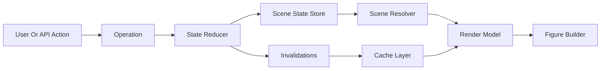

# MatterVis State-Machine Redesign

This directory is the target contract for the MatterVis viewer state machine.
It does not describe the current implementation as acceptable; it describes
the shape future refactors should converge on.

The geometry contract lives in `docs/derivations/`.  This directory builds on
that math and defines how user operations, caches, Dash callbacks, rendering,
and migration stages should compose without hidden side effects.

## Documents

- `state.md`: stored, derived, and ephemeral state categories.
- `operations.md`: pure operation signatures and current coupling risks.
- `caches.md`: cache layers, key contracts, and invalidation ownership.
- `callbacks.md`: Dash callback ownership and single-writer rules.
- `rendering.md`: figure construction, viewport ownership, and camera rules.
- `migration.md`: phased PR roadmap for replacing the current callback mesh.

## Design Principles

### One State Writer

Every persisted state transition should pass through one reducer-like function:

\[
(\mathrm{state}, \mathrm{operation}) \rightarrow
(\mathrm{next\_state}, \mathrm{invalidations})
\]

Dash callbacks, REST endpoints, WebSocket messages, context menus, and tests
should construct operations.  They should not each mutate overlapping state
keys independently.

### Stored vs Derived vs Ephemeral

Persist only user intent and stable scene identity.  Values that can be
computed from other values should be derived at read time or memoized behind a
cache key.  Browser-only interaction state should remain ephemeral unless the
user explicitly saves it.

### Geometry First

Viewport and camera behavior must follow `docs/derivations/camera.md`.
Display-mode atom selection must follow `docs/derivations/display_modes.md`.
Transform semantics must follow `docs/derivations/transforms.md`.

If a state transition would violate those derivations, the state transition is
wrong even if the UI appears to work for one structure.

### Explicit Invalidations

Operations return invalidation facts rather than directly clearing caches:

- `scene_geometry`: atom coordinates, bonds, fragment table, or transforms changed.
- `topology_geometry`: topology shell inputs changed.
- `figure_body`: traces or non-camera layout changed.
- `camera_layout`: viewport scale or default camera compatibility changed.
- `side_panel`: fragment list, summary, or topology text changed.

Cache layers decide how to react to those facts.  Callbacks do not guess cache
keys locally.

### No Hidden Cross-Operation Effects

An operation may reset another field only if that reset is part of the operation
contract.  For example, changing `display_mode` may invalidate
`topology_site_index`, but adding a transform should not reset the user's
camera unless the transform changes viewport scale and the camera policy says
so.

## Target Flow

The reducer is the only writer of persisted scene state.  Scene resolution and
figure building are pure reads from the resolved state plus caches.

## Invariants

- One operation has one named transition function.
- One persisted state key has one owner.
- One Dash Output has one writer, unless a documented reducer dispatcher owns
  all writes to that Output.
- Camera compatibility is tied to viewport scale, not to callback ordering.
- Cache keys are declared in one file and tested with representative operations.

