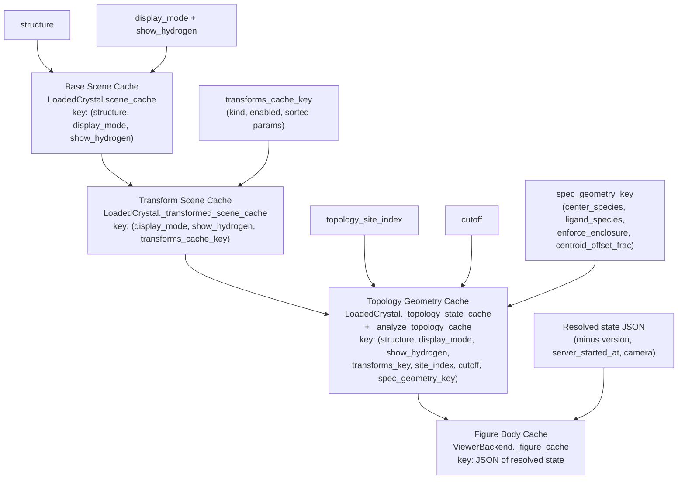
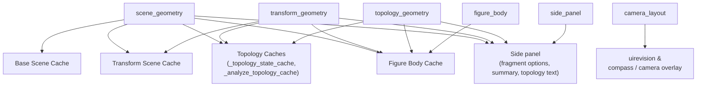

# Cache Contracts

The target design has explicit cache layers.  A cache key is part of the public
internal contract: every input that affects a value must either appear in the
key or be proven irrelevant.

## Cache Layers

The four cache layers form a strict dependency chain: each layer's value is
derived from the next one up plus a small set of extra inputs.  An input that
appears in a downstream layer's key but never feeds an upstream layer is a
signal that the upstream layer's key is too narrow.

### Base Scene Cache

Current location: `LoadedCrystal.scene_cache`.

Target key:

\[
(\mathrm{structure}, \mathrm{display\_mode}, \mathrm{show\_hydrogen})
\]

Value: base scene before transforms, including selected atoms, bonds, labels,
bounds, fragment table, and atom-fragment labels.

Inputs that must not be in the key: colors, camera, labels visibility, axes
visibility, polyhedron colors.

### Transform Scene Cache

Current location: `LoadedCrystal._transformed_scene_cache`.

Target key:

\[
(\mathrm{structure}, \mathrm{display\_mode}, \mathrm{show\_hydrogen},
\mathrm{transforms\_cache\_key})
\]

Value: scene after the transform pipeline, plus transformed fragment table.

This cache is geometry-only.  Transform row `id` and `name` stay out of the key;
`kind`, `enabled`, and normalized `params` stay in.

### Topology Geometry Cache

Current location: `LoadedCrystal._topology_state_cache` and
`LoadedCrystal._analyze_topology_cache`.

Target key:

\[
(\mathrm{structure}, \mathrm{display\_mode}, \mathrm{show\_hydrogen},
\mathrm{transforms\_key}, \mathrm{site\_index}, \mathrm{cutoff},
\mathrm{spec\_geometry\_key})
\]

Value: shell coordinates, hulls, center coordinates, and spec geometry.

Colors and `instance_overrides` are painter inputs, not geometry inputs.

### Figure Body Cache

Current location: `ViewerBackend._figure_cache`.

Target key: JSON-safe resolved state excluding only:

- `version`
- `server_started_at`
- compatible `camera`

The figure body cache may reuse mesh and layout body data across camera drags,
but must refresh camera-dependent overlays such as compass annotations.

### Callback Memo Caches

Current callback-local caches should disappear or be promoted to declared cache
selectors.  The module split fixed two stale-key regressions, but the pattern is
still migration debt:

- `dash_callbacks_view.update_view._topo_cache_key` now includes
  `transforms`, `bond_groups`, and `cutoff`, but it is still an inline tuple
  owned by a callback rather than a named selector.
- `dash_callbacks_state.refresh_fragment_options._cache` now includes
  `transforms_cache_key(transforms)`, but it is still callback-local state.

## Invalidations

| Invalidation | Clears / misses |
| --- | --- |
| `scene_geometry` | base scene, transform scene, topology, figure body, side panel |
| `transform_geometry` | transform scene, topology, figure body, side panel |
| `topology_geometry` | topology, figure body, side panel |
| `figure_body` | figure body only |
| `camera_layout` | camera overlay / uirevision compatibility; not mesh caches |
| `side_panel` | fragment options, summary, topology text |

The reducer emits invalidations.  Cache owners decide whether to clear, miss, or
reuse with overlay refresh.

This is the single picture the redesign is converging on: operations emit
tokens at the top; each token fans down into the caches it has to clear or
miss.  Anything not on the receiving end of an arrow must be left alone — that
is what stops a label-toggle from rebuilding the whole scene, and what stops a
color edit from re-running topology analysis.

## Reverse Hooks

- A transform change must change the fragment-options selector key.
- A bond-group change must either update side-panel summaries or be proven
  irrelevant by a test.
- A polyhedron color-only edit must reuse topology geometry but repaint figure
  traces.

## Invariants

- Cache keys are computed by named selector functions, not inline callback
  tuples.
- A cache value never stores mutable state that callers can modify as a side
  effect.
- Camera is excluded from figure-body cache only after camera compatibility has
  been checked.
- Callback-local memoization cannot omit geometry-changing fields.

