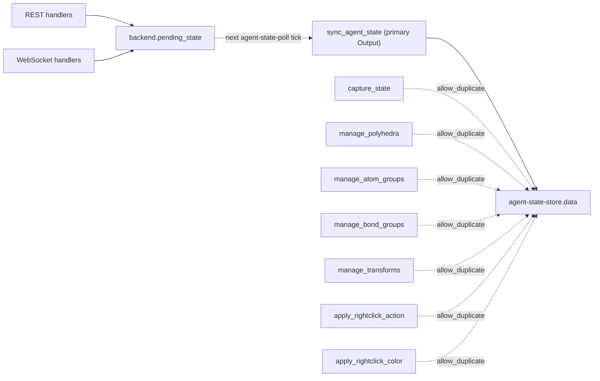
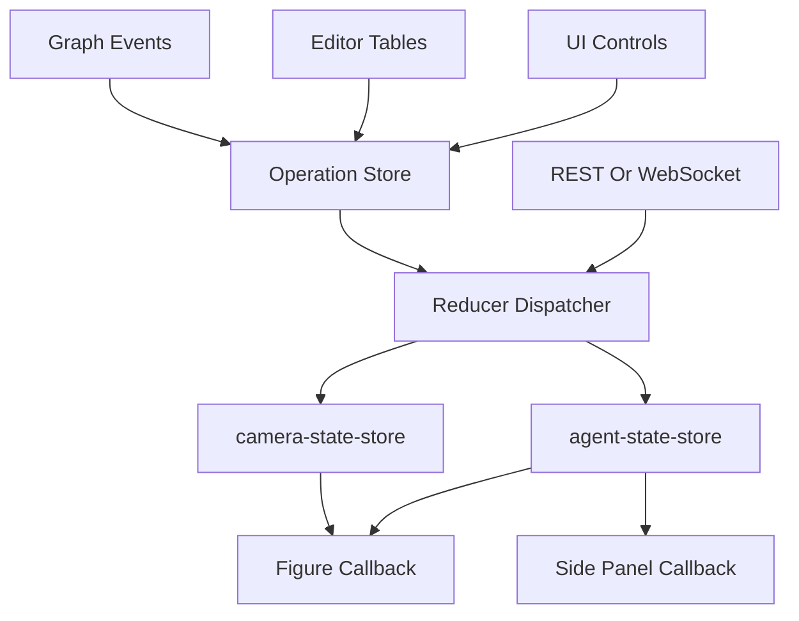
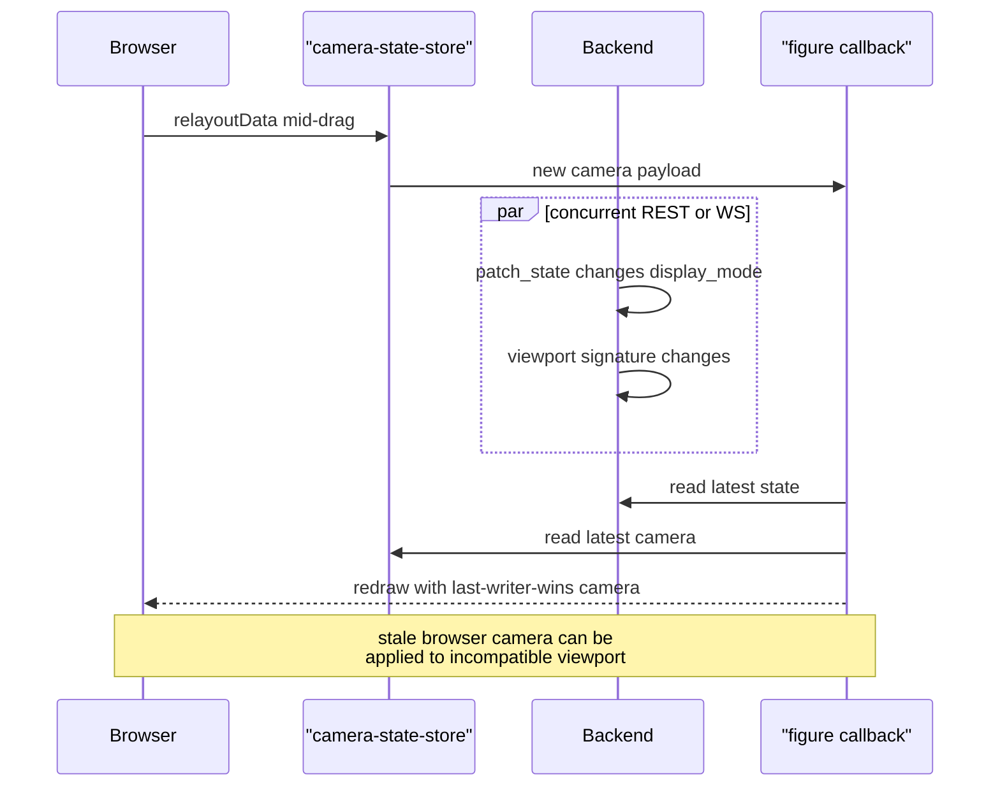

# Dash Callback Ownership

The current Dash app has many callbacks writing the same stores with
`allow_duplicate=True`.  That makes ordering and last-writer-wins behavior part
of the hidden state machine.  The target design routes all persisted state
writes through one reducer dispatcher.

## Target Outputs

| Output | Target writer |
| --- | --- |
| `agent-state-store.data` | reducer dispatcher only |
| `camera-state-store.data` | camera dispatcher only |
| `crystal-graph.figure` | figure renderer only |
| `scene-tabs.children/value` | scene-tab dispatcher only |
| `topology-site-index.value` | topology selection dispatcher only |
| editor table rows | table-specific view models only |

Callbacks may emit operations, not patched state dicts.  A central dispatcher
applies operations and writes stores.

## Phase 1.5 Bridge: Scene Tabs

The current branch pulls `scene-tabs.children` and `scene-tabs.value` ahead of
the full reducer migration:

- `manage_scene_tabs_dom` is the only Dash callback that writes the tab DOM.
  It rebuilds `scene-tabs.children`, `scene-tab-close-row.children`, and
  `scene-tabs.value` from `backend.scene_options()` / `backend.active_scene_id()`.
- Scene CRUD callbacks mutate the backend `SceneStore` and emit
  `scene-event-store.data`; they do not patch tab children or value.
- Native upload JavaScript writes `native-upload-sync.data` only.  It no longer
  calls `set_props("scene-tabs", ...)`.
- `sync_agent_state` still updates control props on tab switches and agent
  polls, but it no longer writes the tab DOM.

This is not the final operation reducer, but it establishes the invariant that
the visible scene list has one writer and one source of truth.

## Current Risk Pattern

Today, these concerns are split:

- `app/callbacks_state.py::capture_state` writes display/style/topology state.
- `app/callbacks_editors.py::manage_polyhedra`,
  `app/callbacks_editors.py::manage_atom_groups`,
  `app/callbacks_editors.py::manage_bond_groups`, and
  `app/callbacks_editors.py::manage_transforms` each write `agent-state-store`.
- right-click actions write state directly.
- REST and WebSocket handlers patch backend state out-of-band.
- camera capture writes backend state while browser camera store remains
  authoritative during drags.
- scene tabs have been moved out of this mixed-writer bucket; new tab DOM
  writes must go through `manage_scene_tabs_dom`.

This makes the real state transition depend on callback scheduling.  Two
callbacks can observe the same old state and write incompatible new states.

The picture below enumerates today's writers of `agent-state-store.data` after
the callback module split.  Solid edges are the one
non-`allow_duplicate` writer (`sync_agent_state`); dashed edges are
`allow_duplicate=True` writers that race against each other and against the
backend-pushed pending-state path:

Any one of those writers can observe a stale snapshot, compute a new dict, and
clobber the others.  The redesign collapses every dashed edge into a single
operation queue consumed by the reducer dispatcher (next section).

## Target Callback Graph

The reducer dispatcher is the only backend state writer.  The figure callback
is a pure reader from state plus camera store.

## Camera Rule

During mouse drag, the browser owns the live camera.  When an operation changes
viewport signature, the reducer must either remap the camera or clear it and
bump `camera_revision`.  The figure callback must not independently decide to
reuse a stale browser camera if the reducer has declared it incompatible.

The race today looks like this: the browser is writing `camera-state-store`
from `relayoutData` while a REST patch concurrently mutates backend state, and
the figure callback reads both sources independently.  Whichever store fires
last decides what the user sees, and the figure may end up with a camera saved
against an incompatible viewport signature.

Under the target rule the reducer owns the compatibility decision: a viewport
change emits a `camera_layout` invalidation, and the figure callback only
reuses the browser camera when the resolver confirms its signature still
matches.

## Reverse Hooks

- A test should fail if a new callback writes `agent-state-store.data` directly
  without going through the reducer dispatcher.
- A test should simulate simultaneous table edit and display toggle and assert
  deterministic operation order.
- A camera drag followed by display-mode change should never reapply the stale
  browser camera to the new viewport signature.

## Invariants

- `allow_duplicate=True` is temporary migration debt, not an acceptable final
  architecture.
- Callback functions do not call `patch_state` except inside the reducer
  dispatcher.
- REST and WebSocket writes use the same operation types as Dash controls.
- Figure callbacks are read-only with respect to persisted state.

