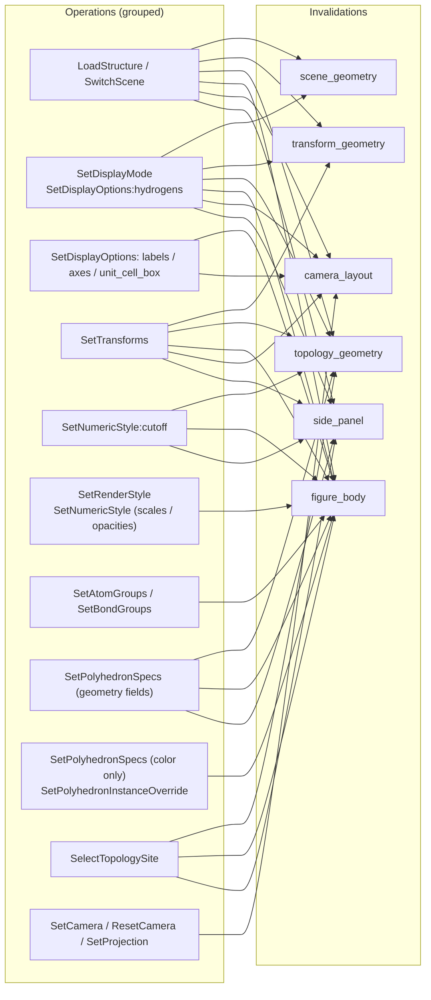
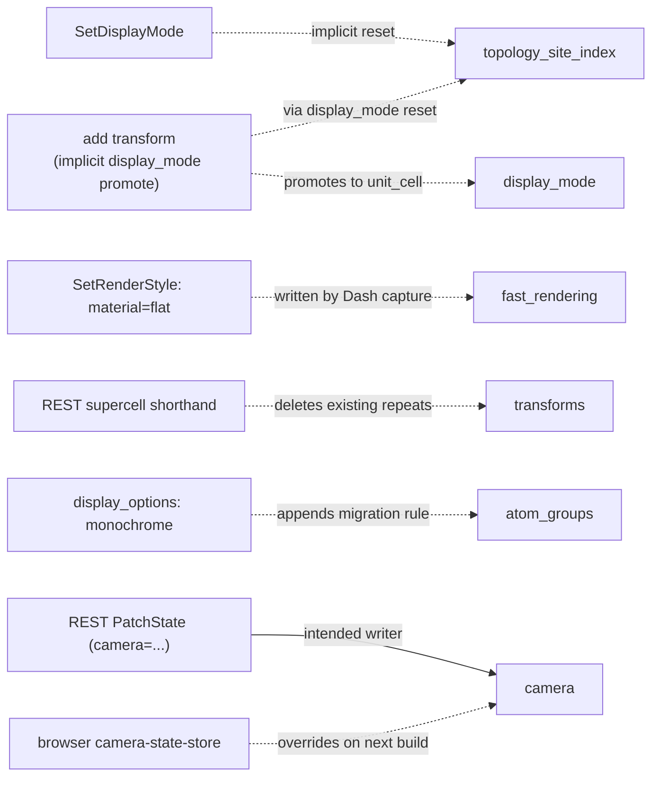

# Operation Model

Every user action should be represented as a typed operation.  The operation
reducer is pure:

\[
\mathrm{reduce}(\mathrm{state}, \mathrm{operation})
\rightarrow
(\mathrm{next\_state}, \mathrm{invalidations})
\]

Callbacks and REST endpoints construct operations; they do not directly patch
individual state keys.

## Operation Catalog

| Operation | Stored keys written | Required invalidations |
| --- | --- | --- |
| `LoadStructure` | `structure`, defaults for the scene | all geometry, topology, figure, side panel, camera |
| `SwitchScene` | active scene id only | figure body, side panel, camera metadata |
| `RenameScene` | `scene_label` | scene tabs only |
| `SetDisplayMode` | `display_mode`, maybe `topology_site_index=None` | scene geometry, topology, figure, side panel, camera layout |
| `SetDisplayOptions` | `display_options` | depends on changed tokens |
| `SetRenderStyle` | style/material/disorder/ORTEP keys | figure body; scene geometry only for style modes that alter atom manifestation |
| `SetNumericStyle` | scales/opacities/cutoff | figure body or topology depending on key |
| `SetCamera` | `camera` | camera layout only |
| `ResetCamera` | `camera`, `camera_revision` | camera layout |
| `SetProjection` | `projection`, camera projection | figure body and camera metadata |
| `SetTransforms` | `transforms` | scene geometry, topology, figure, side panel, camera layout |
| `SetAtomGroups` | `atom_groups` | figure body |
| `SetBondGroups` | `bond_groups` | figure body and side-panel bond summaries if present |
| `SetPolyhedronSpecs` | `polyhedron_specs` | topology geometry if spec geometry changes; figure body if colors only |
| `SetPolyhedronInstanceOverride` | `polyhedron_specs.instance_overrides` | figure body only |
| `SelectTopologySite` | `topology_site_index` | topology, figure body, side panel |

The table above is the contract; the diagram below makes the fan-out visible.
Operations on the left emit one or more invalidation tokens on the right.
Operations that should be cheap (camera, color-only polyhedron edits, label
toggles) must light up only `figure_body` or `camera_layout`; operations that
truly change geometry light up the heavier-left invalidations as well.



## Display Option Diff

`display_options` must be diffed token by token:

| Token | Meaning | Invalidations |
| --- | --- | --- |
| `hydrogens` | atom selection includes H | scene geometry, topology, figure, side panel, camera layout |
| `unit_cell_box` | cell corners visible and own viewport | figure body, camera layout |
| `labels` | label traces visible | figure body only |
| `axes` | axis traces / key visible | figure body only |
| `minor_only` | visible atom filter | figure body and viewport |
| `minor_wireframe` | disorder visual mode | figure body only |

## Current Couplings To Remove

`normalize_state` currently mixes operation semantics.  Specific examples:

- `display_mode` changes clear `topology_site_index` implicitly.
- `add_transform` may promote `display_mode` to `unit_cell`, which also clears
  topology site selection through the same implicit rule.
- `material == "flat"` writes `fast_rendering=True` in Dash capture code,
  coupling two style axes.
- `supercell` deletes existing repeat transforms through a REST shorthand.
- `monochrome` in `display_options` appends an atom-group rule.
- Browser camera state can override REST-patched state during the next figure
  build.

Each of these must become an explicit operation contract or disappear.

The dashed edges below are the implicit writes that the current callback mesh
relies on. Every dashed arrow is a place where callback ordering decides which
value wins, which is the root reason small UI tweaks ship as regressions and
get patched after the fact.



## Target Reducer Shape

```python
def reduce_state(state: SceneState, op: Operation) -> tuple[SceneState, Invalidations]:
    match op:
        case SetDisplayMode(mode=mode):
            return set_display_mode(state, mode)
        case SetDisplayOptions(options=options):
            return set_display_options(state, options)
        case SetCamera(camera=camera):
            return set_camera(state, camera)
        # ...
```

Every branch owns one operation.  Shared helper functions compute invalidations
and camera compatibility, but they do not patch unrelated state on their own.

## Reverse Hooks

- A transform insertion test should assert whether `topology_site_index` is
  reset because of an explicit transform contract, not because `display_mode`
  happened to be patched.
- A display-option test should prove labels/axes toggles do not rebuild scene
  geometry.
- A REST supercell test should verify repeat-transform replacement is declared
  by `SetSupercellShorthand`, not hidden in generic normalization.

## Invariants

- Operation names are stable and appear in logs/test names.
- Operation reducers never read Dash callback context.
- Operation reducers return invalidations; they do not clear caches directly.
- A reset of another key must be documented in the operation row above.

