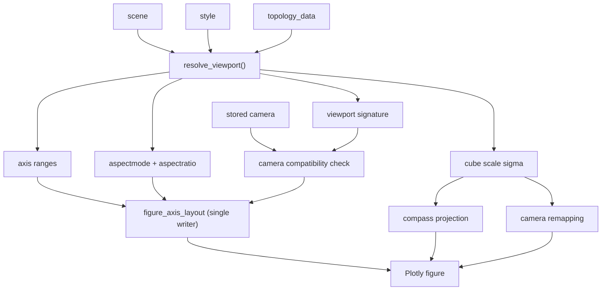
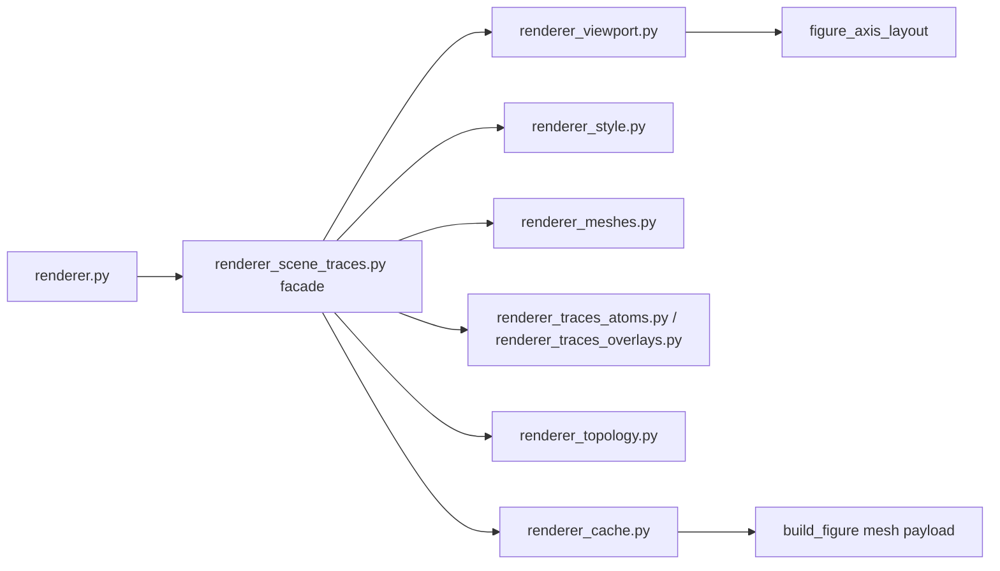

# Rendering Contract

Rendering is a pure read of resolved state:

\[
(\mathrm{scene}, \mathrm{style}, \mathrm{topology}, \mathrm{camera})
\rightarrow
\mathrm{figure}.
\]

It must not mutate persisted state and must not derive new state transitions.

## Single Writer For Viewport Layout

`figure_axis_layout` is the only target owner of:

- axis ranges;
- `aspectmode`;
- `aspectratio`;
- default layout camera;
- `uirevision`;
- scene background.

Any callback or cache branch that wants to alter those fields must do so by
changing the resolved state and rebuilding through the same function.  Partial
figure patches may toggle trace visibility or opacity, but they must not write
axis ranges or aspect ratios.

## Shared Cube Scale

The main scene and compass share the same scale vector
\(\vec\sigma\), defined in `docs/derivations/camera.md`.

The target implementation exposes one selector:

```python
viewport = resolve_viewport(scene, style, topology_data)
```

It returns:

- axis ranges;
- aspect mode and aspect ratio;
- cube scale \(\vec\sigma\);
- viewport signature for camera compatibility.

`figure_axis_layout`, camera remapping, and compass projection all consume that
object.  They do not each rederive ranges independently.



`figure_axis_layout` is the only node that writes `aspectmode`,
`aspectratio`, axis ranges, default layout camera, and `uirevision`.  Compass
projection and camera remapping read the same cube-scale vector, so the
compass cannot point one way while the main scene is framed another.

## Cell Box And Topology Ownership

When `show_unit_cell=True`, the eight cell corners own viewport inclusion in
all display modes.  Topology focus shells own viewport inclusion in all modes.
Topology `extra_overlays` own viewport inclusion only in `unit_cell` mode.

This separates three concepts:

- visible full-cell wireframe;
- focused topology attached to the selected molecule;
- off-focus topology replicas elsewhere in the cell.

## Camera Compatibility

A stored camera is valid only for the viewport signature it was saved against.
If the signature changes, the reducer must choose one policy:

1. remap the camera by old/new \(\vec\sigma\);
2. clear the camera and bump `camera_revision`.

The current minimal fix uses policy 2.  A later redesign may implement policy 1
as a pure helper:

```python
remap_camera(camera, old_viewport, new_viewport) -> camera
```

## Resolved Duplicate Logic

The renderer split turned `renderer_scene_traces.py` into a compatibility
facade.  Viewport math now lives in `renderer_viewport.py`; trace construction
is split across focused `renderer_*` modules; `renderer.py` remains the public
`build_figure` facade.



`renderer_scene_traces.py` no longer owns duplicate viewport helpers; it only
re-exports the split modules for compatibility.  Future renderer changes should
land in the focused module directly, not in the facade.

## Reverse Hooks

- A test should assert only `figure_axis_layout` writes `aspectmode` for the
  main crystal viewer path.
- A test should assert compass axis projection changes when viewport scale
  changes, even if camera direction is unchanged.
- A test should assert `show_unit_cell=True` includes all cell corners while
  `extra_overlays` remain ignored outside `unit_cell`.

## Invariants

- Rendering never patches backend state.
- Camera reuse is forbidden without viewport-signature compatibility.
- Compass, main viewport, and camera remapping consume one cube-scale selector.
- Trace builders emit world-coordinate geometry; layout builders decide how the
  world is framed.

