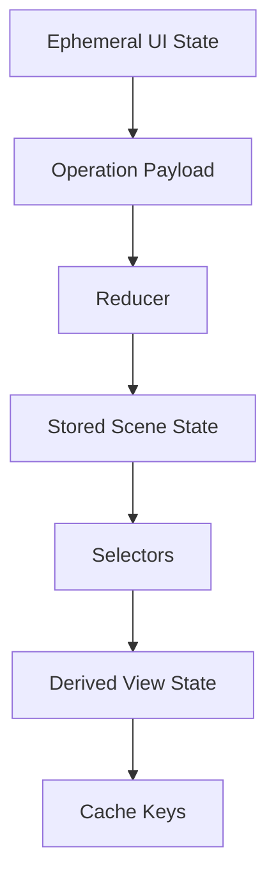

# State Model

MatterVis currently treats the scene state dict as a catch-all object.  It
stores user intent, derived style, cache hints, camera transport, legacy aliases,
and REST shorthands in one namespace.  The target design splits those concerns.

## Target Categories

### Stored State

Stored state is user intent that must survive tab switches, presets, and REST
round trips.

| Key | Target owner | Notes |
| --- | --- | --- |
| `scene_id`, `scene_label` | scene store | Identity and UI label. |
| `structure` | scene store | Catalog/upload structure selected by the scene. |
| `display_mode` | display reducer | `formula_unit`, `unit_cell`, `asymmetric_unit`, `cluster`. |
| `display_options` | display reducer | Checkbox tokens; should eventually become typed booleans. |
| `atom_scale`, `bond_radius`, `minor_opacity`, `axis_scale` | style reducer | Numeric render controls. |
| `material`, `style`, `disorder`, `ortep_mode`, `label_mode` | style reducer | Independent style axes. |
| `projection` | camera reducer | Camera projection intent independent of eye vector. |
| `cutoff` | topology reducer | Candidate shell search radius. |
| `topology_site_index` | topology reducer | Selection into the current fragment list; nullable. |
| `polyhedron_specs` | polyhedra reducer | Named coordination overlays. |
| `atom_groups` | atom-group reducer | Per-atom render overrides. |
| `bond_groups` | bond-group reducer | Per-bond render overrides. |
| `transforms` | transform reducer | Ordered transform pipeline. |
| `camera` | camera reducer | Optional saved camera for a compatible viewport signature. |
| `camera_revision` | camera reducer | Revision counter for accepting layout-supplied camera changes. |

### Derived State

Derived state must not be persisted as independent truth.

| Value | Derivation |
| --- | --- |
| `show_hydrogen` | `"hydrogens" in display_options`. |
| `show_unit_cell` | `"unit_cell_box" in display_options`. |
| `show_axes` | `"axes" in display_options` or axis-key style. |
| `show_labels` | `"labels" in display_options` plus label mode. |
| `monochrome` | Atom-group rule, not a display option. |
| `fast_rendering` | Derived from explicit setting plus `material == "flat"` and atom-count threshold. |
| `uirevision` | Function of scene name, `camera_revision`, and viewport signature. |
| `fragment_options` | Derived from resolved scene fragment table. |
| `topology_payload` | Derived from scene geometry, selected site, cutoff, and specs. |
| `figure` | Derived from render model, topology payload, style, and compatible camera. |

### Ephemeral State

Ephemeral state may exist in the browser or request scope but should not be
treated as durable scene intent.

| Value | Scope |
| --- | --- |
| `version` | Backend polling / cache-busting metadata. |
| `server_started_at` | Backend metadata. |
| `camera-state-store` | Browser-owned live camera during drags. |
| `pending_state` | Backend-to-browser synchronization queue. |
| Click hover payloads | Callback event scope. |
| Right-click menu target | UI event scope. |
| `topology_fragment_type`, `topology_show_all_sites` | Legacy request aliases normalized into stored keys. |
| `supercell` | REST shorthand normalized into a `repeat` transform. |

## Current Gaps

`normalize_state` currently performs too many roles:

- scene switching and structure defaulting;
- legacy request migration;
- style normalization;
- topology selection resets;
- supercell shorthand expansion;
- monochrome-to-atom-group migration;
- camera compatibility handling;
- projection synchronization.

The target reducer should split those into named operations with explicit
invalidations.

## Target Shape

Selectors compute derived values without mutating stored state.  Operations
mutate only stored state.  Caches consume derived keys but do not become state.

## Reverse Hooks

- A test that toggles labels must show no change to scene geometry cache keys.
- A test that changes `display_mode` must invalidate camera compatibility and
  reset or remap the stored camera.
- A test that changes `material` to `flat` must not persist a contradictory
  independent `fast_rendering=False` value.

## Invariants

- No new stored key may be added without declaring its owner and invalidations.
- Legacy aliases are accepted only at API boundaries and are never persisted.
- Derived values are recomputed from selectors; they are not patched by
  callbacks.
- Camera is stored only when compatible with the current viewport signature.

